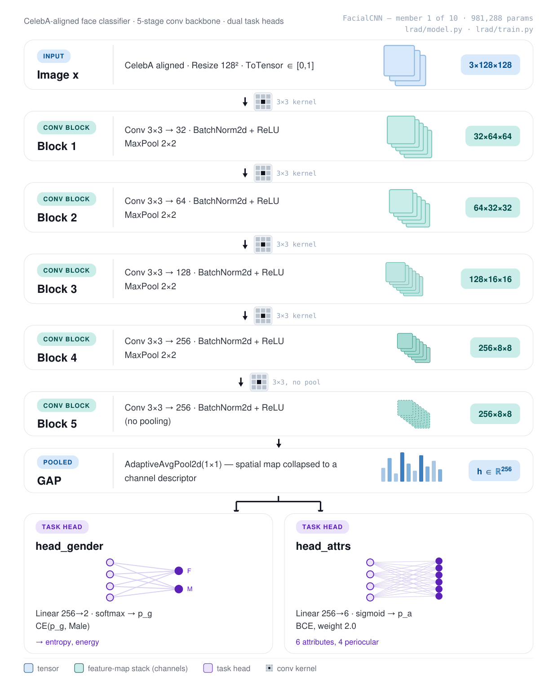
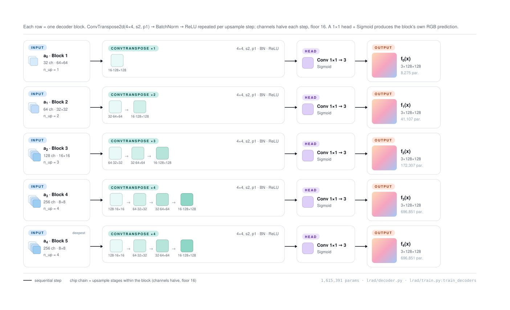
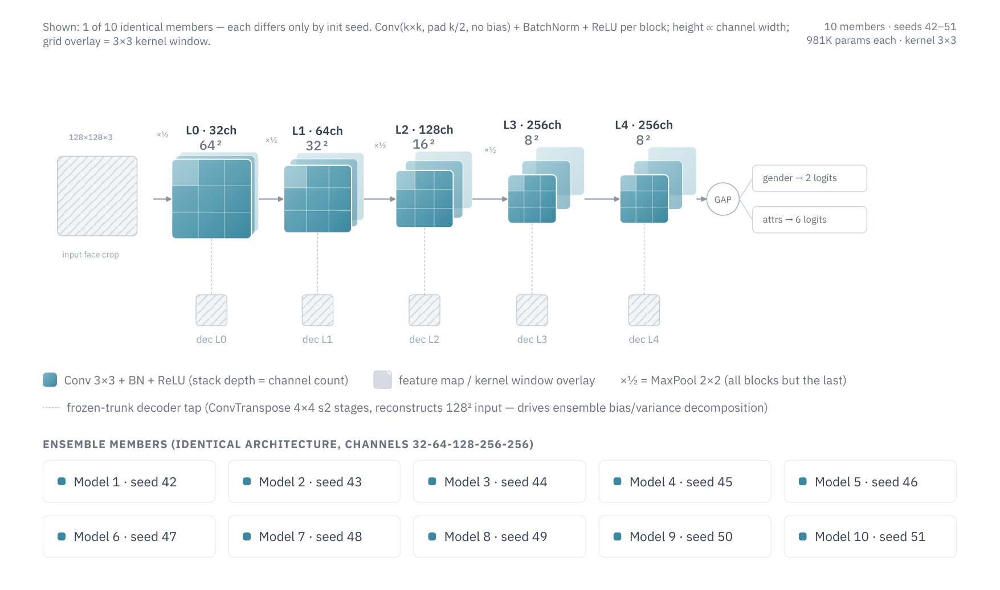

# LRAD — Layer-wise Reconstruction Anomaly Detection

OOD detection on CelebA faces via deep-ensemble reconstruction error decomposed into bias (anomaly) and variance (epistemic uncertainty).


## What it does

A from-scratch convolutional classifier is trained on normal (glasses-free) CelebA faces; lightweight decoders attached to each conv block learn to invert that block's frozen activations back to a full-resolution `(3, H, W)` reconstruction (64 px in `celeba_ood.yaml`, 128 px in `celeba_ood_128.yaml`). Training `M` such models independently forms a **deep ensemble** whose per-pixel reconstruction risk decomposes exactly as `Risk = Bias + Variance`. The **bias** term — the irreducible error of the consensus reconstruction — is the anomaly score; faces wearing **eyeglasses** are held out as OOD (the attribute set is configurable) and score higher. A scoring stack then fuses that reconstruction signal with feature-space and classifier-confidence signals into the headline detector.

## The reference run — `baseline`, a plain 10-seed ensemble

Every number in this README comes from
[`outputs/celeba_ood/ablation/baseline_20260819_133802_6866854/`](outputs/celeba_ood/ablation/baseline_20260819_133802_6866854/), the ablation's **`baseline` arm** ([`configs/ablation_baseline.yaml`](configs/ablation_baseline.yaml)): ten members that all share the **same architecture** — `channels [32, 64, 128, 256, 256]`, `kernel_size 3`, **981,288 parameters each** — seeded 42…51, so the ensemble's *only* source of diversity is weight init + SGD shuffle order. No `member_variants`, no CutPaste pretext head, purely supervised training. 128 px, OAR job 6866854 on an NVIDIA L40S (torch 2.5.1+cu121), 19 August 2026 13:38 → 21:39, ≈ 8 h wall clock for the full ten members.

It is also the best run currently in the repository:

| Detector | `baseline` (this run) | `LASTOF_RESULTS` (arch diversity × CutPaste) [^lastof] |
| --- | --- | --- |
| **`fused_supervised`** | **0.8730** | 0.8638 |
| **`fused_rank`** (label-free) | **0.8420** | 0.8040 |
| best single signal | `ens_energy_gender` **0.8112** | `locfre_b3` 0.7952 |
| `unc_epistemic_combined` | **0.7336** | 0.5387 |
| `p95` bias (reconstruction baseline) | 0.6246 | 0.6228 |

[^lastof]: `LASTOF_RESULTS` was an earlier archived run of the `arch_cutpaste` recipe. Its 1 GB of weights and figures is no longer kept in the repository — the numbers quoted here are what its `ensemble/*.json` reported, and the same recipe is reproducible from [`configs/ablation_arch_cutpaste.yaml`](configs/ablation_arch_cutpaste.yaml).

The plain seed-only control comes out ahead of the architecture-diverse + CutPaste recipe on every one of these. Two caveats before reading that as *"diversity does not help"*: the runs also differ in which signals the fusion could draw on (`LASTOF_RESULTS` fed it `cutpaste_prob`, worth 0.674 alone; this arm has no such head), and the controlled answer is the ablation's `arch` and `cutpaste` arms against this same control — [`scripts/compare_ablation.py`](scripts/compare_ablation.py) settles it, not this table.

### What the run configuration is

- **One architecture, ten seeds**: `ensemble.member_variants` is absent, so `resolve_member_configs` hands every member the same `model` section. Members differ only through `base_seed + i` = 42…51.
- **No pretext task**: `model.cutpaste_head` is off, so the trunk carries two heads (gender + attributes) and 981,288 parameters — 514 fewer than the CutPaste variant. The loss is exactly `CE(gender) + 2.0 · BCE(attrs)`.
- **Single decoder architecture — ConvTranspose2d only**: every ×2 upsampling stage is a learnable `ConvTranspose2d(4×4, stride 2)` + BN + ReLU; the bilinear resize-then-conv variant (and the `upsample` config knob) was removed from the whole pipeline.
- **Glasses-only OOD**: `dataset.ood_attrs: [Eyeglasses]` — train / test_in contain only faces **without** eyeglasses (170,465 train / 18,941 test_in); every face wearing glasses, sunglasses included, is held out as OOD (13,193 images). `val_ratio = 0`, so the full 20 + 25-epoch schedule runs with no early stopping.
- **Eye-region attribute targets**: 4 of the 6 attribute heads are periocular (`Arched_Eyebrows, Bushy_Eyebrows, Narrow_Eyes, Bags_Under_Eyes`; `Smiling, Young` stay global). Training only sees glasses-free faces, so the classifier must attend to the eye area — eyeglasses then occlude exactly that evidence, maximizing the ID/OOD activation gap the bias picks up.
- **Per-instance figures**: each of the 20 ID + 20 OOD test faces gets its own folder with one figure **per ensemble member** (`model_01.png` … `model_10.png`: Original | Recon | Error) plus a `summary.png` (Original | Bias | Mean error | Min error on its raw scale | smoothed-bias overlay). `overlay_sigma` (1.5) and `overlay_power` (0.8) affect **display only**, never the score.
- **Top-10 OOD eyeglasses ranking**: the OOD test set is ranked by eye-region bias strength × concentration into `plots/top_ood_glasses.png` + `top_ood_glasses.json`. The winner (CelebA index 176175) carries an eye-region mean bias of 0.153 against a global mean of 0.040 — a 3.8× concentration.
- **Conference-paper figure styling**: serif (Times-like) typeface with STIX math, the Okabe–Ito colorblind-safe palette with fixed role assignments (ID = blue, OOD = vermillion, variance = orange), recessive axes, 300 dpi export, fixed colour scales so figures stay comparable across runs.

### How uniform ten seeds really are

This is the point of a same-architecture control, and the run makes it measurable:

| Quantity | Spread across the 10 members |
| --- | --- |
| Parameters | 981,288 — identical by construction |
| Gender accuracy | 0.941 … 0.982 |
| Reconstruction AUROC (`p95`, per member) | 0.6290 … 0.6399 (range **0.011**) |
| Decoder MSE at `L0` / `L4` (final epoch) | 0.00040…0.00048 / 0.01110…0.01190 |

No member collapses — which is itself a result, because the archived `LASTOF_RESULTS` run had **two** members degenerate at evaluation. The flip side is visible in the same table: seed-only diversity produces members that reconstruct almost identically, which is exactly the regime where the variance term has the least to say. It still scores 0.6510 aggregated, slightly *above* the bias term's 0.6246.

One genuine wart: the `Young` attribute head is unstable across seeds (accuracy 0.369 … 0.879, against an 79.9 % positive rate in train — several members are effectively inverted on it). `Narrow_Eyes` collapses on member 10 (0.364). Neither is load-bearing for the OOD scores, which read the *gender* logits and the reconstruction error, but the attribute-head entropy signal (`score_entropy_attrs`, 0.42 … 0.60 AUROC) is noisy for the same reason.

## Architecture

**Classifier** — `FacialCNN`, 5-block conv trunk with gender and attribute heads; each block is `Conv(k×k) + BN + ReLU (+ MaxPool2×2, except the last)` and exposes its post-activation tensor for the downstream decoders. In this run every member uses the default `channels = [32, 64, 128, 256, 256]`, `kernel_size = 3`; the `ensemble.member_variants` knob that overrides both per member is what the ablation's `arch` arm turns on.

**Decoders** — one `BlockDecoder` per conv block, upsampling frozen activations back to `(3, image_size, image_size)` through ×2 stages of `ConvTranspose2d(4×4, stride 2) + BN + ReLU`, halving channels per stage down to 16, ending in a 1×1 conv + Sigmoid.

### Diagrams

Four figures in [docs/diagrams/](docs/diagrams/) document the pipeline, each as a `.pdf` (vector source) and a `.png` (what renders below). All four describe the **128 px, same-architecture configuration** of the reference run, so what they draw is what the `baseline` arm actually built.

| Figure | Question it answers | Source of truth |
| --- | --- | --- |
| [pipeline_classifier.png](docs/diagrams/pipeline_classifier.png) · [pdf](docs/diagrams/pipeline_classifier.pdf) | What does **one member** compute, from input tensor to its two heads? | [`lrad/model.py`](lrad/model.py), [`lrad/train.py`](lrad/train.py) |
| [encoder_decoder.png](docs/diagrams/encoder_decoder.png) · [pdf](docs/diagrams/encoder_decoder.pdf) | Where do the **decoders tap** the frozen trunk? | [`lrad/decoder.py`](lrad/decoder.py) |
| [pipeline_decoder.png](docs/diagrams/pipeline_decoder.png) · [pdf](docs/diagrams/pipeline_decoder.pdf) | What are the **five decoders**, lane by lane, and what do they cost? | [`lrad/decoder.py`](lrad/decoder.py), [`lrad/arch_diagram.py`](lrad/arch_diagram.py) |
| [ensemble_architecture.png](docs/diagrams/ensemble_architecture.png) · [pdf](docs/diagrams/ensemble_architecture.pdf) | How do the **10 members** relate — and what does "identical architecture" leave free? | `ensemble.size`, `ensemble.base_seed` |

Every number printed in them (channel widths, spatial sizes, loss weights, parameter counts, seeds) is the one the config resolves to. The same quantities are computed analytically in [`lrad/arch_diagram.py`](lrad/arch_diagram.py) and checked against `sum(p.numel() …)` on the real torch modules in `tests/test_arch_diagram.py`, which is what makes them auditable. A plainer SVG rendering of the same views is generated straight from the config — use it when the config has moved and these figures have not been redrawn yet:

```bash
python scripts/generate_arch_svg.py --config configs/ablation_baseline.yaml \
    --out-dir docs/diagrams
```

`run_ensemble.py` also drops a copy of the ensemble view into `<run>/ensemble/architectures.svg`, annotated with the parameter counts of the members that were actually instantiated.

#### 1. Classifier pipeline — one member, end to end



**How to read it.** One row per stage, top to bottom, in execution order. Each row names the operation on the left, spells it out in the middle, and shows the tensor *leaving* that stage on the right — as a stack of sheets whose face is the spatial extent (`H×W`) and whose depth is the channel count, so the stacks thicken and shrink as the trunk trades resolution for width. Colour is only a category: blue = tensor, teal = conv block, purple = task head. The two boxes at the bottom read the *same* pooled vector in parallel, which is why they hang off one bus rather than off each other.

The trunk is deliberately plain — five `Conv(3×3, pad 1, bias=False) + BatchNorm2d + ReLU` blocks, `MaxPool2×2` after every block **except the last**, then `AdaptiveAvgPool2d(1×1)`. No dropout, no pretrained weights, no skip connections. At 128 px the spatial trace is:

```text
3×128×128 → 32×64×64 → 64×32×32 → 128×16×16 → 256×8×8 → 256×8×8 → GAP → h ∈ R^256
```

Pooling stops one block early on purpose: the last block keeps an 8×8 map so GAP averages over a real spatial extent rather than a single cell, and — more importantly — block 4 and block 5 share a resolution, which lets the deepest two decoders be architecturally identical and their reconstructions directly comparable.

Two linear heads read the 256-d pooled vector:

- **`head_gender` (256→2)** — softmax + CE on the `Male` attribute. It learns the task well (0.94–0.98 test accuracy across members), but its job here is to produce a logit vector whose **energy** and **entropy** move when the classifier hesitates. That turns out to be the single most informative signal in this run: `ens_energy_gender` is worth **0.8112** AUROC on its own, and the per-member gender entropy 0.665–0.812.
- **`head_attrs` (256→6)** — sigmoid + BCE, weighted `attr_loss_weight: 2.0`. Four of the six targets (`Arched_Eyebrows, Bushy_Eyebrows, Narrow_Eyes, Bags_Under_Eyes`) are **periocular**. This is the central design choice of the whole task: training only ever sees glasses-free faces, so the trunk must learn to read the eye region to satisfy these heads — and eyeglasses at test time occlude exactly that evidence. The resulting ID/OOD activation gap is what everything downstream measures.

The total loss is `CE(gender) + 2.0 · BCE(attrs)`, one `.backward()` per step. Nothing else trains the trunk in this arm: no synthetic corruption, no reconstruction loss, no OOD data. The opt-in exception the other ablation arms use is the **CutPaste pretext head** (`model.cutpaste_head` + `training.cutpaste`): a third linear head trained with CE to tell intact faces from faces with a pasted donor patch, adding 514 parameters and its loss at weight 0.5, with the supervised losses then using intact images only.

The member is **981,288 parameters** — 979,232 in the trunk, 2,056 across the two heads. The trunk is ~99.8 % of the model; the heads are almost free. All ten members carry exactly this count.

#### 2. Encoder–decoder architecture — where the decoders tap


**How to read it.** The top row is the same forward pass as figure 1, but unrolled left to right with every sub-operation broken out (`Conv → BN+ReLU → Pool` instead of one fused "block"), so the shape at each intermediate point is explicit. Box **depth (Z) is the channel count**, box **face (X/Y) is the spatial extent**, and kernel/stride sit above each box — which is why the boxes start as thin wide sheets (`128²×3`) and end as narrow deep bars (`8²×256`). The numbered circles labelled `0 tap … 4 tap` are the **decoder taps**: the points where a block's post-pool activation is branched off. The chain underneath expands one of them — the `tap 4` bottleneck — into the actual `BlockDecoder` stages, because all five decoders share that structure and only differ in how many stages they need.

After classifier training the trunk is **frozen** (`eval()`, `requires_grad = False`) and one `BlockDecoder` is trained per conv block to reconstruct the original image from that block's activations alone. Each decoder is a stack of `n_up = log₂(image_size / block_size)` learnable ×2 stages — `ConvTranspose2d(4×4, stride 2, pad 1) + BN + ReLU` — halving channels at every stage down to a floor of 16, closed by `Conv1×1 → 3` + `Sigmoid` so outputs land in `[0,1]` like the inputs. The five decoders are optimised jointly by one Adam on `Σₖ MSE(dₖ(aₖ(x)), x)`.

The 4×4 / stride-2 / pad-1 kernel is chosen because it doubles H and W *exactly*, with no output-size ambiguity — which is what keeps block *k* meaning the same spatial scale across every ensemble member.

#### 3. The decoder stack — five lanes, one per block



**How to read it.** One row per decoder, in tap order. Each row runs `input activation → the chain of ×2 ConvTranspose stages → the 1×1 head → the block's own RGB prediction fₖ(x)`, with the chip chain in the middle showing the channel/resolution at each stage and the parameter cost printed under the output. Read down the first column to see what each decoder starts from; read down the last to see what it costs.

| Decoder | Input activation | `n_up` | Channel path | Params |
| --- | --- | --- | --- | --- |
| `dec L0` | 32×64×64 | 1 | 32→16 | 8,275 |
| `dec L1` | 64×32×32 | 2 | 64→32→16 | 41,107 |
| `dec L2` | 128×16×16 | 3 | 128→64→32→16 | 172,307 |
| `dec L3` | 256×8×8 | 4 | 256→128→64→32→16 | 696,851 |
| `dec L4` | 256×8×8 | 4 | 256→128→64→32→16 | 696,851 |
| | | | **total** | **1,615,391** |

Note the shape of that cost: the two deepest decoders carry 86 % of the parameters, because they start from the widest activation *and* need the most upsampling stages. `dec L3` and `dec L4` are identical in structure — that is the block-4/block-5 shared resolution showing up again. The decoder stack is 1.65× the size of the classifier it inverts.

Reconstruction quality degrades monotonically with tap depth, and by a lot — final-epoch MSE averaged over the ten members runs `0.00044 → 0.00130 → 0.00330 → 0.00538 → 0.01163` from `L0` to `L4`, a factor of **26**. That is mechanical: successive max-pools destroy spatial detail, so a decoder starting from an 8×8 map can only ever paint a blurred face. **This error floor is why every pixel-space score plateaus around 0.62–0.65** — on a clean face, hair and background already contribute thousands of high-error pixels, while a pair of glasses touches a few hundred.

The reconstructions `f̂ₖ` are the substrate for every reconstruction-based score: the exact per-pixel `Risk = Bias + Variance` decomposition across the ensemble (verified at runtime — max absolute residual **2.09e-07**), the localized z-scored patch-max signals, and the per-block `recon_Lk` / `error_Lk` figures.

#### 4. The ensemble — ten identical members, ten seeds



**How to read it.** The top half draws **one** member — all ten are the same — as five cubes, one per conv block, with **height ∝ channel width** and the 3×3 grid overlay standing for the kernel window; `×½` between cubes is the `MaxPool2×2`, and the dotted drops are the five frozen-trunk decoder taps. The bottom half is the roster: ten cards, one per member, each carrying only a seed. That contrast *is* the figure — the architecture panel is drawn once because there is nothing per-member to draw.

Ten members, seeded `base_seed + i` = 42…51, 981,288 parameters each, spatial trace `128 → 64 → 32 → 16 → 8 → 8` shared by construction. Block *k* means the same scale in every member, the per-block decompositions stay aligned, and averaging reconstructions across members is well-defined — trivially so here, where the alignment is by identity rather than by the `resolve_member_configs` check that enforces it when `member_variants` is on.

What that buys, and what it costs, is measured above in [How uniform ten seeds really are](#how-uniform-ten-seeds-really-are): members land within 0.011 AUROC of each other, none collapses, and the variance term still edges out the bias term (0.6510 vs 0.6246). The standard argument for going further — independent inits alone produce members that fail on the *same* inputs, which collapses the variance term — is exactly what the ablation's `arch` arm exists to test against this control.

#### What the diagrams do not cover

The four figures document the *models*. They do not document the **scoring stack**, which is where the headline number comes from — [`lrad/fusion.py`](lrad/fusion.py) calls rank fusion "the headline detector". On this run:

| Signal | AUROC | Where |
| --- | --- | --- |
| `p95` bias (the original reconstruction score) | 0.625 | [`lrad/ensemble.py`](lrad/ensemble.py) |
| `p95` risk | 0.634 | [`lrad/ensemble.py`](lrad/ensemble.py) |
| `zscore_risk_aggregated` (localized) | 0.699 | [`lrad/localized.py`](lrad/localized.py) |
| `unc_epistemic_combined` (predictive MI) | 0.734 | [`lrad/ensemble.py`](lrad/ensemble.py) |
| `locfre_b1` / `locfre_b2` / `locfre_b3` | 0.783 / 0.741 / 0.771 | [`lrad/feature_error.py`](lrad/feature_error.py) |
| `ens_energy_gender` | 0.811 | [`lrad/evaluate.py`](lrad/evaluate.py) |
| **`fused_rank`** (label-free rank fusion) | **0.842** | [`lrad/fusion.py`](lrad/fusion.py) |
| **`fused_supervised`** (logistic fit on a 50 % OOD calibration slice) | **0.873** | [`lrad/fusion.py`](lrad/fusion.py) |

Mind the two evaluation splits: the decomposition and localized rows are scored on the full **18,941 ID vs 13,193 OOD** test set, while the fusion rows hold half the OOD images out for calibration and report on **18,941 ID vs 6,597 OOD**. The gap between the raw bias term (0.625) and the fused detector (0.842 label-free, 0.873 supervised) is the substance of the project, and no current diagram shows it.

[`outputs/celeba_ood/ablation/baseline_20260819_133802_6866854/Documentation.md`](outputs/celeba_ood/ablation/baseline_20260819_133802_6866854/Documentation.md) goes deeper (in French): every formula, every figure it produces, worked numeric examples, and a critical reading of the anomalies.

## Features

- Exact pixelwise `Risk = Bias + Variance` decomposition, verified at runtime (residual 2.09e-07 on the reference run)
- Deep ensemble with two diversity regimes: seed-only (the reference `baseline` run) or per-member channel widths + kernel size via `ensemble.member_variants`
- Predictive-uncertainty decomposition on classifier heads (total = aleatoric + epistemic / MI)
- Per-instance figures: one figure per member (recon + error) and a bias / mean / min + overlay summary, per test face
- Top-N OOD eyeglasses faces ranked by eye-region bias (strength × concentration)
- Configurable OOD attribute set (default: eyeglasses only)
- Optional CutPaste pretext head (`P(altered | x)` joins the fusion signals) and a 4-arm ablation study isolating architecture diversity × CutPaste against this same-arch control
- Epoch-variability study: traces inter-model variability σ(e) from per-epoch decoder checkpoints
- Single YAML config shared by both single-model and ensemble runners; dotted `key=value` CLI overrides (lists supported, e.g. `model.channels=[...]`)

## Tech stack

| Component | Libraries |
| --- | --- |
| Runtime | Python 3.10+, PyTorch 2.4, torchvision |
| Numerics | NumPy < 2.0, SciPy (overlay smoothing), scikit-learn |
| Visualisation | matplotlib (300 dpi export) |
| Config | PyYAML |

## Prerequisites

- Python ≥ 3.10
- CelebA dataset placed at `data/celeba/` (official source, or set `dataset.download: true` in the config to let torchvision fetch it)
- CUDA optional but recommended for ensemble runs

## Installation

```bash
# editable install, loose deps (CPU or pre-installed torch)
pip install -e .

# pinned CUDA 11.8 stack (Grid'5000 / Ampere GPUs)
pip install -r requirements.txt \
    --extra-index-url https://download.pytorch.org/whl/cu118
```

## Quick start

```bash
# 1. ensemble + bias/variance decomposition (primary pipeline)
python scripts/run_ensemble.py --config configs/celeba_ood.yaml

# 2. single model (classifier + decoders + confidence/fusion scores)
python scripts/run_celeba.py --config configs/celeba_ood.yaml

# 3. re-run decomposition on already-trained models
python scripts/run_ensemble.py --config configs/celeba_ood.yaml \
    --output-dir outputs/celeba_ood/my_run --eval-only

# 4. run tests
pytest
```

Both runners accept `--override key=value …` for dotted config overrides and `--no-plots`.

## Grid'5000 batch runs (Nancy)

From the Nancy frontend, in `~/lrad` (OAR directives — cluster, GPU, walltime — are embedded in the scripts):

```bash
# 10-model ensemble at 64 px (per-member architectures via member_variants)
./scripts/oar_run_ensemble.sh

# same ensemble at 128 px (gruss / A40, walltime 48 h)
./scripts/oar_run_128.sh

# ablation study: one job per arm, in parallel (gres/grat/gruss — first free
# L40S / A100 / A40 GPU — walltime 48 h)
./scripts/oar_run_ablation.sh              # baseline + arch + cutpaste
                                           # (baseline = the reference run above)
ARMS=all ./scripts/oar_run_ablation.sh     # also re-run arch_cutpaste

# track / cancel
oarstat -u $USER
tail -f outputs/celeba_ood/_oar/oar.<jobid>.stdout
oardel <jobid>
```

The job requests **1 GPU on `graffiti` (RTX 2080 Ti, 11 GiB) in the production/Abaca queue, walltime 48 h**. graffiti is the largest GPU pool at Nancy (12 nodes × 4 GPUs), so allocation is usually fast; the run needs < 10 GiB of VRAM, and ~3 h/model × 10 models fits comfortably in 48 h (a 2080 Ti is ~2–3× slower than the A100 this used to run on). The walltime is sized generously on purpose: an OAR job is cut at its walltime even mid-epoch and the ensemble run does not checkpoint. Note the production queue does **not** allow advance reservations (`oarsub -r`) — submission only. Fallback clusters (edit the `#OAR -p` line): `gruss` (2× A40 45 GiB) or `grue` (4× T4 15 GiB).

## Ablation study — what does each ingredient buy?

The ensemble recipe has two deliberate ingredients on top of a plain deep
ensemble: **architecture diversity** (`ensemble.member_variants`) and the
**CutPaste pretext task** (`model.cutpaste_head` + `training.cutpaste`,
[`lrad/cutpaste.py`](lrad/cutpaste.py)). The ablation isolates them with four
arms that differ **only** in those two factors (128 px, 10 members, seeds
42..51, identical schedules — [`configs/ablation_baseline.yaml`](configs/ablation_baseline.yaml)
documents the invariants):

| Arm | Members | Pretext | Config |
| --- | --- | --- | --- |
| `baseline` | 10 × same architecture | — | [`ablation_baseline.yaml`](configs/ablation_baseline.yaml) — **run, see above** |
| `arch` | 10 different architectures | — | [`ablation_arch.yaml`](configs/ablation_arch.yaml) |
| `cutpaste` | 10 × same architecture | CutPaste | [`ablation_cutpaste.yaml`](configs/ablation_cutpaste.yaml) |
| `arch_cutpaste` | 10 different architectures | CutPaste | [`ablation_arch_cutpaste.yaml`](configs/ablation_arch_cutpaste.yaml) |

Three case studies, all against the same control: **(1)** `arch` vs
`baseline` — architecture diversity alone; **(2)** `cutpaste` vs `baseline` —
the pretext alone; **(3)** `arch_cutpaste` vs `baseline` — both together.
That is what separates the genuinely beneficial ingredient from the marginal
one. The `arch_cutpaste` recipe had already been run as
`outputs/celeba_ood/LASTOF_RESULTS`, so by default only the first three arms
are submitted; `compare_ablation.py` still picks that directory up as the
fourth arm when it is present on disk, and simply omits the arm otherwise —
it is no longer stored in the repository. The control
arm itself is the reference run documented at the top of this README
(`baseline_20260819_133802_6866854`), and it currently posts the best fused
AUROC of any run in the repo — so the case studies have to argue *against* it,
not merely beat the raw reconstruction score.

```bash
# submit (one OAR job per arm — the arms train in parallel on the first
# free GPUs among gres / grat / gruss)
./scripts/oar_run_ablation.sh

# merge the finished arms into tables + figures (idempotent; the last OAR
# job also runs this automatically)
python scripts/compare_ablation.py
```

Every arm run dir has the same structure (`model_0..9/` + `ensemble/` with
all plots, `fused_auroc.json`, `localized_auroc.json`) — the `baseline` arm is
committed in full as a worked example.
[`scripts/compare_ablation.py`](scripts/compare_ablation.py) then writes
`outputs/celeba_ood/ablation/comparison/`: the per-arm results table
(`ablation_table.md`/`.csv`/`ablation_results.json`) and four figures —
grouped AUROC bars per metric, the signed Δ-vs-baseline panels for the three
case studies, per-block Risk/Bias/Variance curves per arm, and the per-member
spread (does diversity widen the member distribution while the ensemble
improves?).

## Usage examples

**Override ensemble size and learning rate:**

```bash
python scripts/run_ensemble.py --config configs/celeba_ood.yaml \
    --override ensemble.size=3 training.lr=5e-4
```

**Trace inter-model variability vs training epochs** (requires `training.save_every_epoch: true`):

```bash
python scripts/epoch_variability_study.py \
    --config configs/celeba_ood.yaml \
    --run-dir outputs/celeba_ood/my_run \
    --all-blocks --include-ood
```

## Configuration

`configs/celeba_ood.yaml` is the single source of truth for both runners.

| Section | Key parameters |
| --- | --- |
| `dataset` | `root`, `image_size`, `batch_size`, `train_ratio`, `val_ratio`, `ood_attrs` (attribute name or list defining OOD; default `[Eyeglasses]`) |
| `model` | `channels` (one int per conv block), `kernel_size` (3/5), `n_attrs`, `n_gender`, `cutpaste_head` (adds the binary pretext head) — the architecture every member is built from unless `ensemble.member_variants` overrides it |
| `training` | `epochs` (20), `lr`, `attr_loss_weight`, `save_every_epoch`; nested `decoders: {epochs (25), lr}`; optional `cutpaste: {prob, area_range, aspect_range, scar_prob, loss_weight}` (pretext task; supervised losses then use intact images only) |
| `evaluation` | `n_viz_in_samples`, `n_viz_ood_samples`, `viz_seed`, `score_comparison_block`, `score_comparison_k`, `n_instances_in`, `n_instances_ood`, `instance_block`, `overlay_sigma`, `overlay_power` (display-only knobs of the bias overlay), `n_top_ood` (size of the top OOD eyeglasses ranking) |
| `ensemble` | `size`, `base_seed` (model `i` uses `base_seed + i`), `agg` (`mean` / `max` / `p95`), `member_variants` (**optional** per-member `{channels, kernel_size}`, cycled if `size` exceeds the list; omit it — as the reference run does — for a seed-only ensemble) |

## Project structure

```text
lrad/
├── lrad/                          # library (flat layout)
│   ├── dataset.py                 # CelebA loaders; configurable accessory OOD split
│   ├── config.py                  # YAML load + dotted `key=value` CLI overrides
│   ├── model.py                   # FacialCNN: conv trunk + gender/attrs (+ CutPaste) heads
│   ├── cutpaste.py                # CutPaste synthetic occlusions (pretext task)
│   ├── decoder.py                 # per-block ConvTranspose2d decoders
│   ├── train.py                   # classifier + decoder training loops
│   ├── evaluate.py                # accuracy + classifier-confidence OOD AUROC
│   ├── anomaly_score.py           # per-pixel error + pixel→scalar reductions
│   ├── ensemble.py                # bias/variance decomposition + eye-region bias
│   ├── localized.py               # per-pixel z-score + multi-scale patch-max
│   ├── feature_error.py           # localized feature-reconstruction error (locfre)
│   ├── fusion.py                  # rank / supervised fusion — headline detector
│   ├── arch_diagram.py            # member-config resolution, param counts, SVG renderers
│   ├── plots.py                   # all figures (300 dpi, paper styling)
│   └── utils.py                   # device, seeding, logging
├── configs/
│   ├── celeba_ood.yaml            # base config (64 px)
│   ├── celeba_ood_128.yaml        # 128 px, supervised heads only
│   └── ablation_*.yaml            # the four ablation arms (see above)
├── docs/
│   └── diagrams/                  # the four figures above, .pdf source + .png
├── scripts/
│   ├── run_celeba.py              # single-model pipeline
│   ├── run_ensemble.py            # ensemble + decomposition + instance figures
│   ├── run_localized.py           # localized z-score / patch-max scoring
│   ├── run_fused.py               # fused (locfre + epistemic + energy) AUROC
│   ├── run_generalization.py      # bias overlay on non-CelebA photos (sanity probe)
│   ├── compare_ablation.py        # merge the ablation arms: tables + figures
│   ├── generate_arch_svg.py       # regenerate the architecture diagrams as SVG
│   ├── epoch_variability_study.py # σ(e) variability vs decoder epochs
│   └── oar_run_*.sh               # Grid'5000 OAR jobs (ensemble, fused, localized, 128 px)
└── tests/                         # pytest: anomaly score, decomposition,
                                   #         decoders, training, plots, checkpointing
```

Outputs are gitignored, with the three ablation arms and their merged `comparison/` force-added as references. An ensemble run writes per-model results under `model_<i>/` (weights, history, plots) and the decomposition under `ensemble/` (AUROC table, identity residual, all heatmap figures, `top_ood_glasses.png` + `.json`), with the per-instance figures under `ensemble/plots/instances_{in,ood}/<ID|OOD>_XX/` (one folder per face: `model_01.png` … `model_10.png` + `summary.png`).

## Contributing

Open an issue or pull request. Run `pytest` and confirm no regressions before submitting.

## License

MIT — see [LICENSE](LICENSE).
