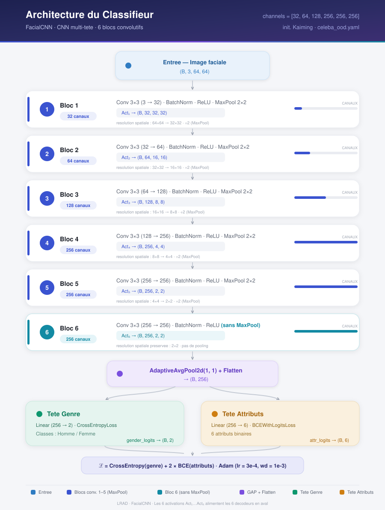

# LRAD — Layer-wise Reconstruction Anomaly Detection

> Out-of-distribution face detection from how well a **deep ensemble**
> reconstructs an image **block by block**, decomposing the reconstruction
> error into a **bias** term (the anomaly) and a **variance** term
> (inter-model disagreement / epistemic uncertainty).


---

## Overview

We study unsupervised out-of-distribution (OOD) detection on CelebA, treating
eyeglasses as a held-out distribution shift. A convolutional classifier is
trained from scratch on glasses-free faces; a lightweight decoder attached to
each convolutional block reconstructs the input from that block's activations.
Training `M` such models independently yields a **deep ensemble**, and the
per-pixel reconstruction risk admits an exact bias–variance decomposition. The
**bias** term — the irreducible error of the consensus (ensemble-mean)
reconstruction — is used as the anomaly score, while the **variance** term
quantifies model disagreement and serves as an epistemic-uncertainty signal.

---

## Method

**Protocol.** In-distribution = `Eyeglasses == 0`; OOD = `Eyeglasses == 1`,
withheld from training and used only at evaluation. With `val_ratio = 0` there
is no validation loop or early stopping — ensemble diversity is induced solely
by random initialization and SGD ordering, not by divergent stopping points.
Both the classifier and the decoders run a long 30-epoch schedule with **no
weight decay**, and a checkpoint is written at **every epoch**
(`model_ep{e}.pt` / `decoders_ep{e}.pt`, flag `training.save_every_epoch`) so
the inter-model variability can be traced as a function of training time.

**Classifier.** A from-scratch multi-head CNN (Conv–BN–ReLU(–MaxPool) blocks,
trunk depth set by `model.channels`) whose globally averaged feature feeds two
heads: gender (2-way softmax, cross-entropy) and six binary facial attributes
(sigmoid, BCE). Accessory attributes (hats, makeup, …) are deliberately
excluded so the trunk encodes identity/expression traits rather than features
that would partially generalize to eyewear. No dropout.



*The classifier forward path: input `(B, 3, 64, 64)` through six conv blocks
(blocks 1–5 halve the spatial map with MaxPool, block 6 keeps `2×2`), then
global average pooling into the gender and attribute heads. The six block
activations `Act₁…Act₆` are exactly what the decoders invert downstream.*

**Per-block decoders.** With the classifier frozen, one decoder per block is
trained under MSE to invert that block's activations to a `(3, 64, 64)`
reconstruction.



*The six `BlockDecoder`s. Each takes one frozen activation `Actₖ` and upsamples
it back to a `(3, 64, 64)` reconstruction through `N = log₂(64 / in_size)`
`bilinear Upsample(×2) → Conv3×3 → BN → ReLU` stages, closing with a `1×1`
conv + sigmoid. Bilinear-then-conv replaces the former `ConvTranspose2d`
stages (still shown in the diagram above), which can produce checkerboard
artefacts that add noise to the reconstruction-error estimate. The lower
panel expands the deepest decoder's five upsampling steps.*

**Decomposition.** For block `k`, image `x`, pixel `i`, with the `M`
reconstructions `f̂ᵐ` and their consensus `f̄ = (1/M) Σ f̂ᵐ`:

```text
Risk(x)[i]      = (1/M) Σ_m ( x[i] − f̂ᵐ(x)[i] )²
Bias(x)[i]      =          ( x[i] − f̄(x)[i] )²
Variance(x)[i]  = (1/M) Σ_m ( f̂ᵐ(x)[i] − f̄(x)[i] )²
```

These satisfy the pointwise identity `Risk = Bias + Variance` exactly (verified
at run time; max residual ≈ `3.9e-7`). The anomaly score is the **bias term
alone** — no whitening, no normalization — reduced to a per-image scalar by a
percentile aggregation (default `p95`) and combined across blocks.

Two complementary per-pixel views are also computed across the ensemble: the
**minimum** error `min_m (x − f̂ᵐ)²` (how well the *best* member reconstructs a
pixel) and its **robust quantile variant** — the k-th smallest of the `M`
per-model errors (`k = 3` by default, via `torch.kthvalue`; `k = 1` recovers
the exact minimum). The `score_comparison` figure puts the Bias, Risk, min and
quantile-min maps side by side at the deepest block, each column with its
**own colour scale** (the scores are not identically distributed, so no
shared normalization).

**Epoch-variability study.** From the per-epoch checkpoints,
`scripts/epoch_variability_study.py` traces

```text
sigma(e) = sqrt( mean_I mean_p Var_m[ err_m(I, p) ] )
```

— the square root of the mean (over test images and pixels) of the Variance
term of the decomposition — as a function of the training epoch `e`, at the
deepest block by default (`--all-blocks` for one curve per block,
`--include-ood` for a second curve on the OOD split). Computation streams
over the test loader in O(1) memory and writes a CSV/JSON table plus
`sigma_vs_epochs.png`. Protocol note: since decoders are trained on the
*final frozen* classifier, the script implements the simple variant —
classifier fixed at its full schedule, `sigma(e)` varying the **decoder**
epochs only (documented in the script).

**Baselines.** Classifier-confidence OOD scores (max-softmax probability and
predictive entropy of both heads) are reported for comparison.

---

## Results

Deep ensemble of 10 models (seeds 42–51), 6-block trunk, `agg = p95`,
`Eyeglasses` shift.

> **Note** — the numbers below were obtained with the *previous*
> configuration (2-epoch schedule, weight decay, ConvTranspose2d decoders)
> and will be refreshed once the new setup (30 epochs, no weight decay,
> bilinear + conv decoders) has been re-run.

| Metric                                        | Value          |
|-----------------------------------------------|----------------|
| In-distribution gender accuracy               | 95.9 – 97.7 %  |
| **OOD AUROC — Bias (anomaly), aggregated**    | **0.608**      |
| OOD AUROC — Bias, best block                  | 0.641          |
| OOD AUROC — Risk / Variance, aggregated       | 0.605 / 0.579  |
| Max residual of `Risk = Bias + Variance`      | 3.9e-7         |

The task is intentionally difficult — eyeglasses occlude a small, localized
region — so AUROCs sit modestly above chance and the confidence baselines are
less stable. The contribution is the **decomposition** itself: isolating the
bias, which carries the OOD signal, from the variance, which reflects mere
inter-model disagreement.

---

## Repository structure

```text
lrad/
├── lrad/                 # library (flat layout)
│   ├── dataset.py        # CelebA loaders; Eyeglasses split for OOD
│   ├── model.py          # FacialCNN: conv trunk + gender/attrs heads
│   ├── decoder.py        # per-block reconstruction decoders
│   ├── train.py          # classifier + decoder training loops
│   ├── evaluate.py       # accuracy + classifier-confidence OOD AUROC
│   ├── anomaly_score.py  # per-pixel error + pixel→scalar reductions
│   ├── ensemble.py       # bias/variance decomposition of the ensemble
│   ├── plots.py          # all figures
│   └── utils.py          # device, seeding, logging
├── configs/celeba_ood.yaml   # single config for both runners
├── scripts/
│   ├── run_celeba.py     # single-model pipeline
│   ├── run_ensemble.py   # ensemble + decomposition
│   ├── epoch_variability_study.py  # σ(e) inter-model variability vs epochs
│   └── oar_run_ensemble.sh   # Grid'5000 / OAR wrapper
├── tests/                # pytest: anomaly score, decomposition, decoders, training
└── docs/                 # notes and derivations
```

---

## Installation

```bash
# editable install, loose deps (CPU or pre-installed torch)
pip install -e .

# or the pinned CUDA 11.8 stack used on Grid'5000
pip install -r requirements.txt \
    --extra-index-url https://download.pytorch.org/whl/cu118
```

Python ≥ 3.10. Core dependencies: torch, torchvision, numpy (<2.0),
scikit-learn, matplotlib, pyyaml, Pillow.

## Quick start

```bash
# ensemble + bias/variance decomposition (primary pipeline)
python scripts/run_ensemble.py --config configs/celeba_ood.yaml

# re-run the decomposition on already-trained models
python scripts/run_ensemble.py --config configs/celeba_ood.yaml \
    --output-dir outputs/celeba_ood/ensemble_run --eval-only

# single model (classifier + decoders + confidence/fusion scores)
python scripts/run_celeba.py --config configs/celeba_ood.yaml

# sigma(e): inter-model variability vs training epochs, from the
# per-epoch checkpoints of an ensemble run
python scripts/epoch_variability_study.py --config configs/celeba_ood.yaml \
    --run-dir outputs/celeba_ood/ensemble_run [--all-blocks] [--include-ood]
```

Both runners accept `--override key=value …` (dotted paths, e.g.
`ensemble.size=3`) and `--no-plots`.

## Configuration

`configs/celeba_ood.yaml` is the single source of truth for both runners.

| Section      | Key parameters                                                              |
|--------------|----------------------------------------------------------------------------|
| `dataset`    | `root`, `image_size`, `batch_size`, `train_ratio`, `val_ratio`             |
| `model`      | `channels` (one integer per conv block), `n_attrs`, `n_gender`             |
| `training`   | `epochs`, `lr`, `weight_decay` (0 by default), `attr_loss_weight`, `save_every_epoch` (per-epoch checkpoints); nested `decoders: {epochs, lr, …}` |
| `evaluation` | `n_viz_{in,ood}_samples`, `viz_seed`; optional `score_comparison_block` / `score_comparison_k` |
| `ensemble`   | `size`, `base_seed` (model *i* uses `base_seed + i`), `agg`                |

## Outputs

Everything under `outputs/` is gitignored. An ensemble run writes a full
single-model result set per member (`model_<i>/`, including the per-epoch
checkpoints `model_ep{e}.pt` / `decoders_ep{e}.pt` when
`training.save_every_epoch` is on) plus the decomposition under `ensemble/`:
per-image Risk/Bias/Variance AUROCs, the identity residual, and figures
(`ensemble_decomposition`, `decomposition_auroc`, `mean_abs_bias`,
`mean_error_maps`, `min_error_maps`, `score_comparison`,
`variance_heatmaps_*`, `fusion_overlay`,
`bias_variance_vs_{block,percentile}`). The epoch-variability study adds
`epoch_variability/sigma_vs_epochs.{csv,json,png}` under the run directory.

## Tests

```bash
pytest
```

Covers the anomaly-score reductions, the ensemble decomposition (including the
`Risk = Bias + Variance` identity and the quantile-min error maps, where
`k = 1` must match the exact minimum), the decoder architecture (all six
blocks reconstruct to `(3, 64, 64)` with bilinear upsampling), training with
`val_ratio = 0`, and the per-epoch checkpointing.

---

## License

MIT — see [LICENSE](LICENSE).
