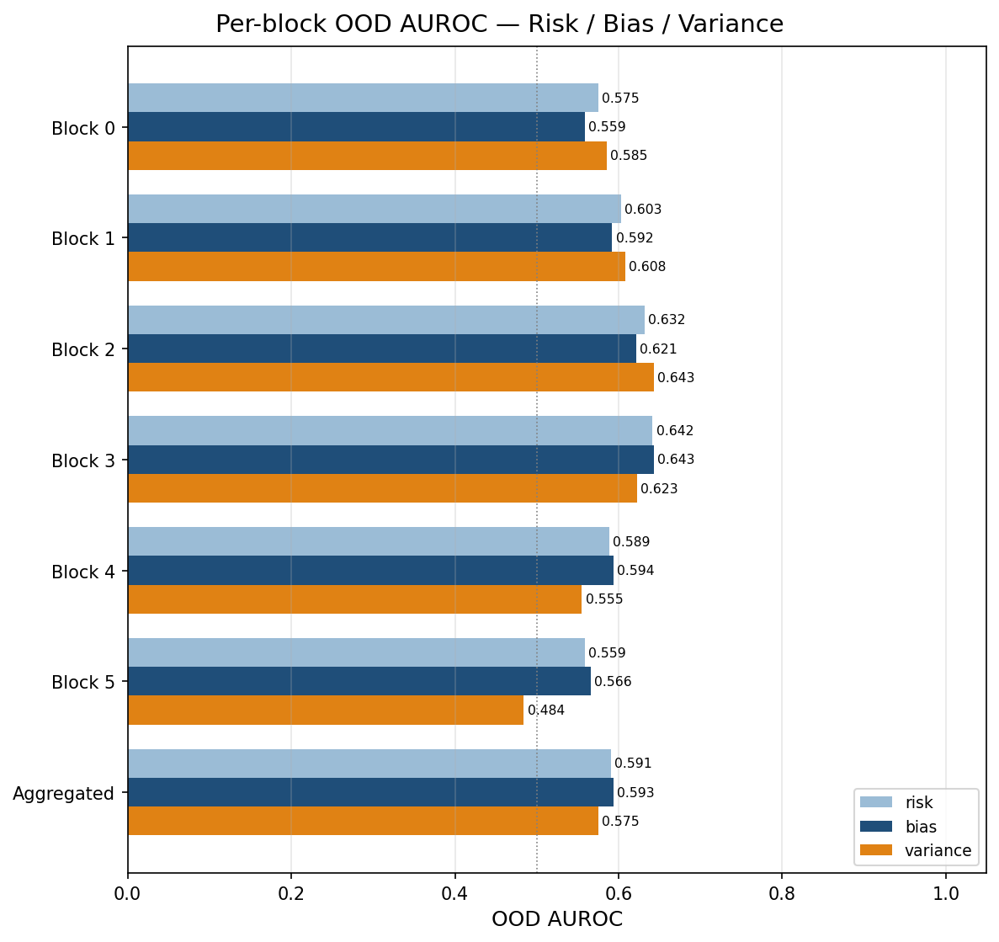
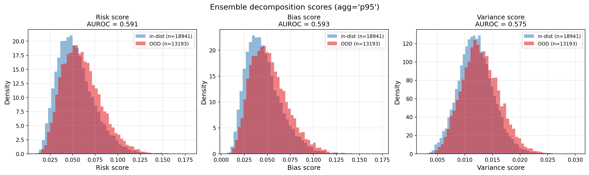
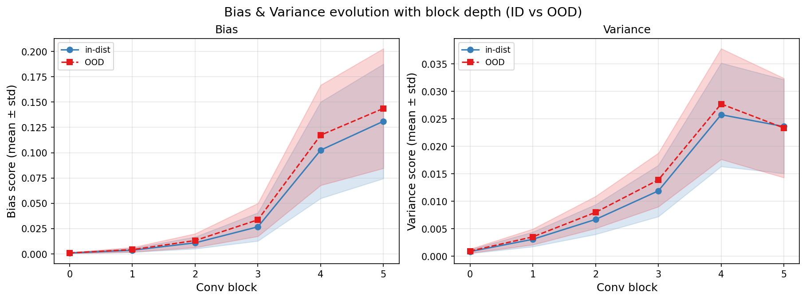
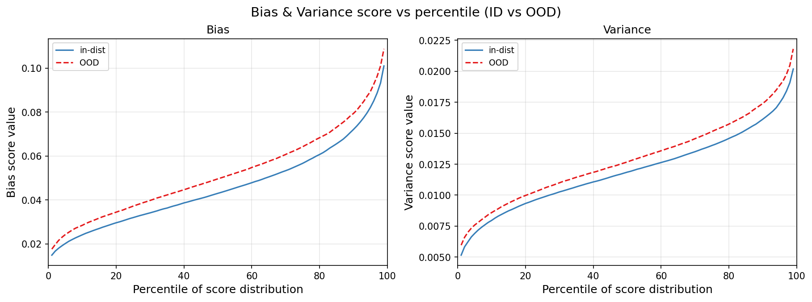

# LRAD — Layer-wise Reconstruction Anomaly Detection

> Flag out-of-distribution faces (eyeglasses) by **how badly a deep ensemble
> reconstructs them, layer by layer** — and split that reconstruction error
> into a *bias* part (the anomaly) and a *variance* part (model disagreement).


---

## What this is

A from-scratch CNN is trained on CelebA faces that have **no eyeglasses**
(`Eyeglasses == 0`). Per conv block, a small decoder learns to reconstruct
the input image from that block's activations. Train several such models
independently — a **deep ensemble** — and for any image you get one
reconstruction per model.

The per-pixel, per-block reconstruction error then splits exactly into two
terms:

```text
Risk  =  Bias  +  Variance
```

* **Bias** = error of the *ensemble-mean* reconstruction `(x − f̄)²`. This is
  the consensus model's irreducible error — what survives ensembling. It is
  the **anomaly score**: a face wearing glasses can't be reconstructed from
  features the trunk only ever learned on glasses-free faces, so its bias
  spikes.
* **Variance** = how much the independently-trained models *disagree*
  `mean_m (f̂ᵐ − f̄)²`. On OOD inputs the models extrapolate differently, so
  variance doubles as an **epistemic-uncertainty** OOD signal.

There is no σ-whitening and no division: the anomaly is the raw bias term
`bias = risk − variance = (x − f̄)²`.

CelebA images with `Eyeglasses == 1` (sunglasses included) are never shown
during training and are used only as the OOD set at evaluation.

---

## Method

### 1. In-distribution protocol

| Split        | Selection            | Role                                   |
|--------------|----------------------|----------------------------------------|
| train / test_in | `Eyeglasses == 0` | clean faces; train + held-out in-dist  |
| test_ood     | `Eyeglasses == 1`    | OOD at eval (the model never saw these)|

The clean pool is split by ratio (default `train_ratio=0.90`,
`val_ratio=0.00`). With `val_ratio=0` there is **no validation loop and no
early stopping** — every model runs the full epoch schedule, which is exactly
what a clean deep ensemble wants (diversity comes only from the random init +
SGD shuffle order, never from a shared val-based stopping point).

### 2. The classifier (`FacialCNN`)

A multi-head conv trunk, no pretrained weights. Each block is
`Conv3×3 → BN → ReLU (→ MaxPool2×2)`; the last block omits the pool. A global
average pool feeds two linear heads:

```text
Input (B, 3, 64, 64)
  Block1  Conv(3→32)   + BN + ReLU + MaxPool   → (32, 32, 32)
  Block2  Conv(32→64)  + BN + ReLU + MaxPool   → (64, 16, 16)
  Block3  Conv(64→128) + BN + ReLU + MaxPool   → (128, 8, 8)
  Block4  Conv(128→256)+ BN + ReLU + MaxPool   → (256, 4, 4)
  Block5  Conv(256→256)+ BN + ReLU + MaxPool   → (256, 2, 2)
  Block6  Conv(256→256)+ BN + ReLU             → (256, 2, 2)
  AdaptiveAvgPool → (256,)
    head_gender : Linear(256 → 2)   # Male / Female      — softmax + CE
    head_attrs  : Linear(256 → 6)   # 6 binary attributes — sigmoid + BCE
```

The number of blocks is set by `model.channels` — the default library model
is 5 blocks; the shipped config uses 6 (`[32, 64, 128, 256, 256, 256]`).
The in-distribution targets are:

| Head    | Attribute(s)                                                                 | Loss                |
|---------|------------------------------------------------------------------------------|---------------------|
| gender  | Male / Female                                                                | `CrossEntropyLoss`  |
| attrs   | Young, Smiling, Mouth_Slightly_Open, High_Cheekbones, Pointy_Nose, Oval_Face | `BCEWithLogitsLoss` |

Combined objective, one backward step:

```text
loss = CE(gender_logits, gender) + attr_loss_weight · BCE(attr_logits, attrs)
```

Accessory attributes (Wearing_Hat, Heavy_Makeup, …) are deliberately **not**
targets — the trunk should learn identity/expression facial features, not
accessory features that would partly generalize to sunglasses.

> **No Dropout.** Ensemble diversity is meant to come purely from independent
> random init + SGD shuffle order (a deep ensemble), not from MC-Dropout.

### 3. Per-block decoders

With the classifier frozen, one `BlockDecoder` per conv block is trained
(MSE) to upsample that block's activations back to a `(3, 64, 64)`
reconstruction via a `ConvTranspose2d → BN → ReLU` stack ending in a `1×1`
conv + `Sigmoid`. These reconstructions `f̂` are what the bias/variance
decomposition consumes, and they also drive the per-block visualization plots.

### 4. Deep-ensemble bias/variance decomposition

For block `k`, image `x`, pixel `i` (per-pixel value = RGB mean), with the `M`
reconstructions `f̂ᵐ` and their mean `f̄ = (1/M) Σ f̂ᵐ`:

```text
Risk_k(x)[i]      = (1/M) Σ_m ( x[i] − f̂ᵐ(x)[i] )²        per-model error
Bias_k(x)[i]      =          ( x[i] − f̄(x)[i] )²          error of mean recon
Variance_k(x)[i]  = (1/M) Σ_m ( f̂ᵐ(x)[i] − f̄(x)[i] )²    model disagreement
```

These satisfy `Risk = Bias + Variance` exactly, pixel by pixel (verified at
runtime — the max residual on the shipped run is `1.4e-7`).

Per-pixel maps are reduced to one scalar per image with `agg` ∈ `{mean, max,
p95}` (default `p95` — robust to lone hot pixels but still fires on a localized
occlusion like glasses), then combined across blocks (uniform or weighted) and
scored by AUROC on `test_in` (label 0) vs `test_ood` (label 1).

### 5. Classifier-confidence baseline

For reference, the single-model runner also reports the usual
confidence-based OOD scores from the classifier head outputs:

* `score_msp` — `1 − max softmax(gender)`
* `score_entropy_gender` — entropy of the gender softmax
* `score_entropy_attrs` — mean Bernoulli entropy over the 6 attribute heads
* `score_entropy_combined` — `gender + attrs` entropy

---

## Results

10-model ensemble (seeds 42–51), 6-block trunk, `agg = p95`, on the
`Eyeglasses` OOD split.

| Metric                                   | Value          |
|------------------------------------------|----------------|
| In-distribution gender accuracy          | ~97.2 – 97.6 % |
| **Anomaly (Bias) AUROC — aggregated**    | **0.593**      |
| Anomaly (Bias) AUROC — best block        | 0.643          |
| Risk / Variance AUROC — aggregated       | 0.591 / 0.575  |
| `Risk = Bias + Variance` max residual    | 1.4e-7         |

OOD detection on this task is genuinely hard — eyeglasses occlude a small,
localized region — so the AUROCs sit modestly above chance; the
classifier-confidence baselines are weaker and unstable across seeds
(MSP/entropy AUROC ranges ~0.48–0.70). The point of the project is the
**decomposition**: isolating the bias term that actually carries the OOD
signal from the variance term that reflects ensemble disagreement.

<p align="center">
  
  
</p>
<p align="center">
  
  
</p>

*(Figures are from the 10-model run; regenerate them with `run_ensemble.py` —
full-size image-grid plots stay under the gitignored `outputs/`.)*

---

## Project structure

```text
lrad/
├── lrad/                       # core library (flat layout)
│   ├── dataset.py              # CelebA loaders; filters Eyeglasses for the OOD split
│   ├── model.py                # FacialCNN: conv trunk + gender/attrs heads
│   ├── decoder.py              # per-block reconstruction decoders
│   ├── train.py                # classifier training + decoder training
│   ├── evaluate.py             # accuracy + classifier-confidence OOD AUROC
│   ├── anomaly_score.py        # per-pixel error + pixel→scalar reductions
│   ├── ensemble.py             # deep-ensemble bias/variance decomposition
│   ├── plots.py                # all figures
│   ├── utils.py                # device, seeding, logging
│   └── __init__.py
├── configs/
│   └── celeba_ood.yaml         # single config — used by both runners
├── scripts/
│   ├── run_celeba.py           # single-model orchestrator
│   ├── run_ensemble.py         # deep-ensemble orchestrator + decomposition
│   ├── oar_run_celeba.sh       # Grid'5000 / OAR wrapper (single model)
│   └── oar_run_ensemble.sh     # Grid'5000 / OAR wrapper (ensemble)
├── tests/                      # pytest: anomaly score, ensemble, no-val training
├── docs/                       # lightweight result figures used in this README
├── requirements.txt            # pinned (CUDA 11.8) deps for Grid'5000
├── setup.py
└── README.md
```

---

## Installation

```bash
# Editable install with loose deps (CPU or whatever torch you already have)
pip install -e .

# Or the pinned CUDA 11.8 stack used on Grid'5000 (Pascal/A100 GPUs)
pip install -r requirements.txt \
    --extra-index-url https://download.pytorch.org/whl/cu118
```

Python ≥ 3.10. Core deps: torch, torchvision, numpy (<2.0), scikit-learn,
matplotlib, pyyaml, Pillow.

## Quick start

```bash
# Deep ensemble + bias/variance decomposition (the headline pipeline).
# size / base_seed / agg come from the ensemble: block of the config.
python scripts/run_ensemble.py --config configs/celeba_ood.yaml

# Custom size / output dir
python scripts/run_ensemble.py --config configs/celeba_ood.yaml \
    --output-dir outputs/celeba_ood/ensemble_run --ensemble-size 5

# Re-run the decomposition on already-trained models (no retraining)
python scripts/run_ensemble.py --config configs/celeba_ood.yaml \
    --output-dir outputs/celeba_ood/ensemble_run --eval-only
```

Single model (classifier + decoders + confidence/fusion scores):

```bash
python scripts/run_celeba.py --config configs/celeba_ood.yaml
python scripts/run_celeba.py --config configs/celeba_ood.yaml --eval-only
python scripts/run_celeba.py --config configs/celeba_ood.yaml \
    --override training.epochs=50 dataset.batch_size=128
```

Both runners accept `--override key=value …` (dotted paths, e.g.
`ensemble.size=3`) and `--no-plots`.

## Configuration

`configs/celeba_ood.yaml` is the single source for both runners:

| Section      | Key keys                                                                 |
|--------------|--------------------------------------------------------------------------|
| `experiment` | `name`, `seed`, `output_dir`                                             |
| `dataset`    | `root`, `download`, `image_size`, `batch_size`, `train_ratio`, `val_ratio` |
| `model`      | `channels` (one int per conv block), `n_attrs`, `n_gender`               |
| `training`   | `epochs`, `lr`, `weight_decay`, `attr_loss_weight`; nested `decoders: {epochs, lr, …}` |
| `evaluation` | `n_viz_in_samples`, `n_viz_ood_samples`, `viz_seed`                      |
| `ensemble`   | `size`, `base_seed` (model *i* is seeded `base_seed + i`), `agg`         |

Set `training.decoders` to null to skip decoder training (the ensemble
decomposition then has nothing to reconstruct, so keep it for `run_ensemble`).

## Outputs

Everything under `outputs/` is **gitignored** (runs are large — model weights
and high-res plots). A single-model run writes to `experiment.output_dir`:

```text
weights/model.pt, weights/decoders.pt
history.json, decoders_history.json, summary.json, config.resolved.yaml
plots/  training_history · batch_accuracy · score_dist_* · roc_ood
        per_block_breakdown · recons_only · activations
        fusion_overlay · fusion_auroc
logs/
```

An ensemble run writes one full per-model result set plus the decomposition:

```text
model_<i>/            full single-model results, one per ensemble member
ensemble/summary.json per-model + decomposition AUROC, identity residual,
                      headline anomaly_auroc (the Bias term)
ensemble/plots/       ensemble_decomposition · decomposition_auroc
                      ensemble_score_hists · mean_recon_breakdown
                      mean_recons_only · mean_abs_bias
                      variance_heatmaps_{ood,all}
                      bias_variance_vs_{block,percentile}
logs/ · config.resolved.yaml
```

## Grid'5000 / OAR

```bash
./scripts/oar_run_ensemble.sh '2026-05-28 20:00:00'   # advance reservation
./scripts/oar_run_ensemble.sh                          # submit immediately
oarstat -u $USER
tail -f outputs/celeba_ood/_oar/oar.<jobid>.stdout
```

The wrappers target the `gratouille` cluster, reserve a GPU (a 10-model
ensemble on the 6-block trunk runs ~11–13 h), and stream a per-run output
folder under `outputs/celeba_ood/`.

## CelebA download

If the torchvision Google-Drive download fails on a compute node, fetch the
archive once on the frontend and unpack it under `data/celeba/`:

```text
data/celeba/img_align_celeba/        (202,599 .jpg files)
data/celeba/list_attr_celeba.txt
data/celeba/list_eval_partition.txt
data/celeba/identity_CelebA.txt
data/celeba/list_bbox_celeba.txt
data/celeba/list_landmarks_align_celeba.txt
```

## Tests

```bash
pytest
```

Covers the anomaly-score reductions, the ensemble decomposition (including the
`Risk = Bias + Variance` identity), and `val_ratio=0` training.

---

## License

MIT — see [LICENSE](LICENSE).
