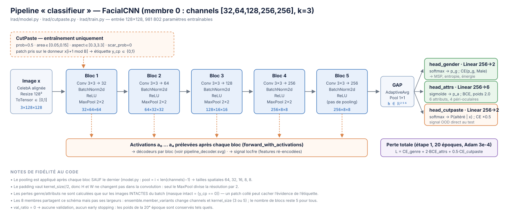
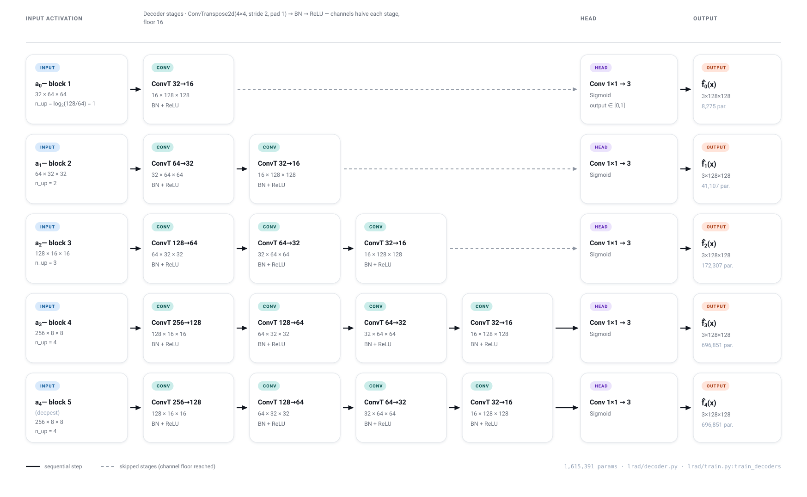
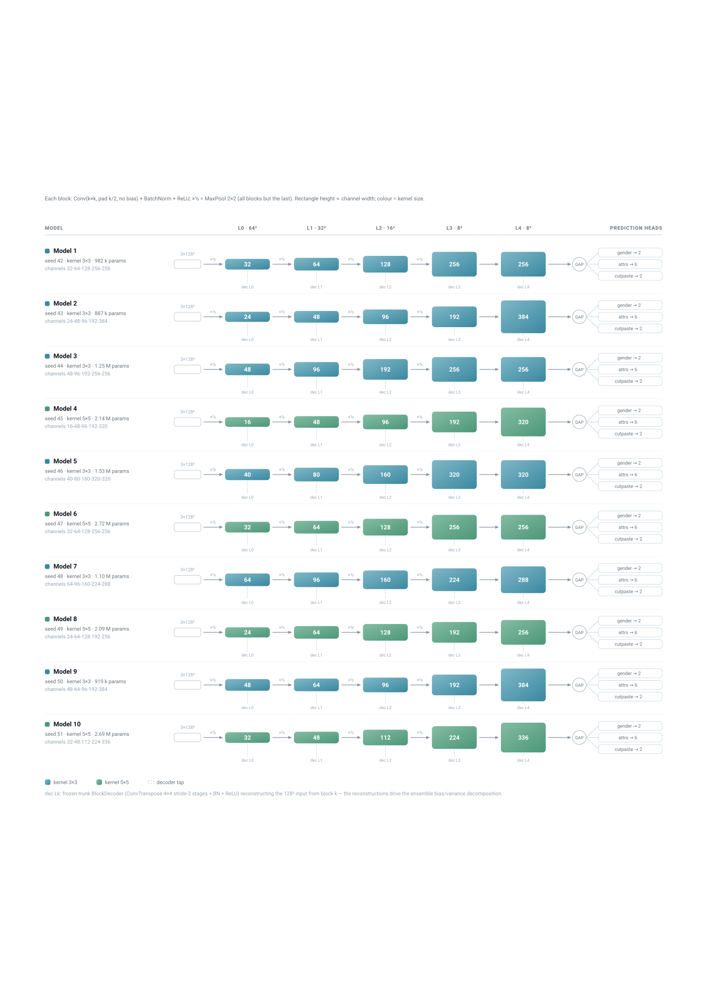

# LRAD — Layer-wise Reconstruction Anomaly Detection

OOD detection on CelebA faces via deep-ensemble reconstruction error decomposed into bias (anomaly) and variance (epistemic uncertainty).


## What it does

A from-scratch convolutional classifier is trained on normal (glasses-free) CelebA faces; lightweight decoders attached to each conv block learn to invert that block's frozen activations back to a full-resolution `(3, H, W)` reconstruction (64 px in `celeba_ood.yaml`, 128 px in `celeba_ood_cutpaste128.yaml`). Training `M` such models independently forms an **architecturally diverse deep ensemble** — each member has its own channel widths and conv kernel size (`ensemble.member_variants`), on top of its own weight init and SGD shuffle order — whose per-pixel reconstruction risk decomposes exactly as `Risk = Bias + Variance`. The **bias** term — the irreducible error of the consensus reconstruction — is the anomaly score; faces wearing **eyeglasses** are held out as OOD (the attribute set is configurable) and score higher.

## What was done in this run

- **Single decoder architecture — ConvTranspose2d only**: every ×2 upsampling stage is a learnable `ConvTranspose2d(4×4, stride 2)` + BN + ReLU; the bilinear resize-then-conv variant (and the `upsample` config knob) was removed from the whole pipeline.
- **Per-member architectures**: `ensemble.member_variants` gives each of the 10 members its own trunk (channel widths + 3×3 or 5×5 convs, ~0.9M–2.7M parameters) while keeping the exact same 5-block / pool-after-first-4 spatial layout, so the per-block decompositions stay aligned across members.
- **Glasses-only OOD**: `dataset.ood_attrs: [Eyeglasses]` — training/val/test_in contain only faces **without** eyeglasses (normal images); every face wearing glasses (sunglasses included) is held out as OOD. Wearing_Hat was dropped from the OOD set.
- **Eye-region attribute targets**: 4 of the 6 attribute heads are eye-region attributes (`Arched_Eyebrows, Bushy_Eyebrows, Narrow_Eyes, Bags_Under_Eyes`; `Smiling, Young` stay as global targets). Training only sees glasses-free faces, so the classifier must attend to the eye area — eyeglasses then occlude exactly that evidence, maximizing the ID/OOD activation gap the bias picks up.
- **Schedules**: 20 classifier epochs + 25 decoder epochs per member (`val_ratio=0`, no early stopping).
- **Per-instance figures restructured**: each test face gets its own folder with one figure **per ensemble member** (`model_01.png` … `model_10.png`: Original | Recon | Error) plus a `summary.png` (Original | Bias | Mean error | Min error on its raw scale | smoothed-bias overlay). The per-tile numeric score annotations were removed everywhere — the maps read through the shared colour bars. `overlay_sigma` (now 3) and `overlay_power` affect **display only**, never the score.
- **Top-10 OOD eyeglasses ranking**: the full OOD test set (restricted to `Eyeglasses` faces) is ranked by eye-region bias strength × concentration and the winners are written to `plots/top_ood_glasses.png` + `top_ood_glasses.json`.
- **Conference-paper figure styling**: serif (Times-like) typeface with STIX math, the Okabe–Ito colorblind-safe palette with fixed role assignments (ID = blue, OOD = vermillion, variance = orange), recessive axes (no top/right spines, light grid), 300 dpi export, fixed colour scales so figures stay comparable across runs.

## Architecture

**Classifier** — `FacialCNN`, 5-block conv trunk with gender and attribute heads; each block is `Conv(k×k) + BN + ReLU (+ MaxPool2×2, except the last)` and exposes its post-activation tensor for the downstream decoders. The single-model default is `channels = [32, 64, 128, 256, 256]`, `kernel_size = 3`; ensemble members override both via `ensemble.member_variants`.

**Decoders** — one `BlockDecoder` per conv block, upsampling frozen activations back to `(3, image_size, image_size)` through ×2 stages of `ConvTranspose2d(4×4, stride 2) + BN + ReLU`, halving channels per stage down to 16, ending in a 1×1 conv + Sigmoid.

### Diagrams

Three figures in [docs/diagrams/](docs/diagrams/) document the pipeline. All three are drawn for the **128 px CutPaste configuration** ([`configs/celeba_ood_cutpaste128.yaml`](configs/celeba_ood_cutpaste128.yaml)) — the run behind `outputs/celeba_ood/LASTOF_RESULTS`.

They are **generated from the config**, not drawn by hand, so they cannot drift from what the code builds — every channel width, spatial size, loss weight and parameter count in them is derived at render time and checked against torch in `tests/test_arch_diagram.py`:

```bash
python scripts/generate_arch_svg.py --config configs/celeba_ood_cutpaste128.yaml
```

| Figure | What it shows | Source of truth |
| --- | --- | --- |
| [pipeline_classifier.svg](docs/diagrams/pipeline_classifier.svg) | One member's forward pass, input tensor → three heads | [`lrad/model.py`](lrad/model.py), [`lrad/train.py`](lrad/train.py) |
| [pipeline_decoder.svg](docs/diagrams/pipeline_decoder.svg) | The five per-block decoders that invert the frozen trunk | [`lrad/decoder.py`](lrad/decoder.py) |
| [ensemble_architectures_celeba_ood_cp128.svg](docs/diagrams/ensemble_architectures_celeba_ood_cp128.svg) | All 10 ensemble members side by side | `ensemble.member_variants` |

#### 1. Classifier pipeline



The trunk is deliberately plain — five `Conv(k×k, pad k/2, bias=False) + BatchNorm2d + ReLU` blocks, `MaxPool2×2` after every block **except the last**, then `AdaptiveAvgPool2d(1×1)`. No dropout, no pretrained weights, no skip connections. At 128 px the spatial trace is:

```text
3×128×128 → 32×64×64 → 64×32×32 → 128×16×16 → 256×8×8 → 256×8×8 → GAP → h ∈ R^256
```

Pooling stops one block early on purpose: the last block keeps an 8×8 map so GAP averages over a real spatial extent rather than a single cell, and — more importantly — block 4 and block 5 share a resolution, which lets the deepest two decoders be architecturally identical and their reconstructions directly comparable.

Three linear heads read the 256-d pooled vector:

- **`head_gender` (256→2)** — softmax + CE on the `Male` attribute. Its job in this project is *not* accuracy (it sits near 0.63); it is to produce a logit vector whose **energy** and **entropy** move when the classifier hesitates. `ens_energy_gender` is a fusion input worth 0.713 AUROC on its own.
- **`head_attrs` (256→6)** — sigmoid + BCE, weighted `attr_loss_weight: 2.0`. Four of the six targets (`Arched_Eyebrows, Bushy_Eyebrows, Narrow_Eyes, Bags_Under_Eyes`) are **periocular**. This is the central design choice of the whole task: training only ever sees glasses-free faces, so the trunk must learn to read the eye region to satisfy these heads — and eyeglasses at test time occlude exactly that evidence. The resulting ID/OOD activation gap is what everything downstream measures.
- **`head_cutpaste` (256→2)** — the self-supervised pretext head, active only when `model.cutpaste_head: true`. During training, [`lrad/cutpaste.py`](lrad/cutpaste.py) pastes a patch cut from a *donor* face in the same batch onto some images, and this head learns intact vs. altered (CE, `loss_weight: 0.5`). It exists because the post-hoc scoring stack plateaued near 0.81: the models had never been shown what "something covers this face" looks like. At test time `P(altered | x)` transfers to real occlusions (0.674 AUROC standalone) without any real OOD data ever being seen.

The supervised losses are computed on intact images only; the pretext CE covers the whole batch. Total loss is `CE(gender) + 2.0 · BCE(attrs) + 0.5 · CE(cutpaste)`, one `.backward()` per step.

The baseline member (`channels [32, 64, 128, 256, 256]`, `k=3`, cutpaste head on) is **981,802 parameters** — 979,232 in the trunk, 2,570 across the three heads. The trunk is ~99.7 % of the model; the heads are almost free.

#### 2. Decoder pipeline



After classifier training the trunk is **frozen** and one `BlockDecoder` is trained per conv block to reconstruct the original image from that block's activations alone. Each decoder is a stack of `n_up = log₂(image_size / block_size)` learnable ×2 stages — `ConvTranspose2d(4×4, stride 2, pad 1) + BN + ReLU` — halving channels at every stage down to a floor of 16, closed by `Conv1×1 → 3` + `Sigmoid` so outputs land in `[0,1]` like the inputs.

The 4×4/stride-2/pad-1 kernel is chosen because it doubles H and W *exactly*, with no output-size ambiguity — which is what keeps block *k* meaning the same spatial scale across every ensemble member.

| Decoder | Input activation | `n_up` | Channel path | Params |
| --- | --- | --- | --- | --- |
| `dec L0` | 32×64×64 | 1 | 32→16 | 8,275 |
| `dec L1` | 64×32×32 | 2 | 64→32→16 | 41,107 |
| `dec L2` | 128×16×16 | 3 | 128→64→32→16 | 172,307 |
| `dec L3` | 256×8×8 | 4 | 256→128→64→32→16 | 696,851 |
| `dec L4` | 256×8×8 | 4 | 256→128→64→32→16 | 696,851 |
| | | | **total** | **1,615,391** |

Note the shape of that cost: the two deepest decoders carry 86 % of the parameters, because they start from the widest activation *and* need the most upsampling stages. `dec L3` and `dec L4` are identical in structure — that is the block-4/block-5 shared resolution showing up again.

The reconstructions `f̂_k` are the substrate for every reconstruction-based score: the exact per-pixel `Risk = Bias + Variance` decomposition across the ensemble, the localized z-scored patch-max signals, and the per-block `recon_Lk` / `error_Lk` figures.

#### 3. Ensemble architectures



The ensemble is *architecturally* diverse, not just seed-diverse. Ten members, seeded `base_seed + i` = 42…51, each with its own channel widths and conv kernel size from `ensemble.member_variants`:

| # | Seed | Channels | Kernel | Params | Intent |
| --- | --- | --- | --- | --- | --- |
| 1 | 42 | 32-64-128-256-256 | 3×3 | 981,802 | baseline |
| 2 | 43 | 24-48-96-192-384 | 3×3 | 887,266 | slim early, wide late |
| 3 | 44 | 48-96-192-256-256 | 3×3 | 1,245,114 | wide early |
| 4 | 45 | 16-48-96-192-320 | 5×5 | 2,136,954 | slim + large receptive field |
| 5 | 46 | 40-80-160-320-320 | 3×3 | 1,532,530 | 1.25× width |
| 6 | 47 | 32-64-128-256-256 | 5×5 | 2,720,042 | baseline, large RF |
| 7 | 48 | 64-96-160-224-288 | 3×3 | 1,102,986 | flat progression |
| 8 | 49 | 24-64-128-192-256 | 5×5 | 2,092,098 | narrow late, large RF |
| 9 | 50 | 48-64-96-192-384 | 3×3 | 919,098 | heavy head + tail |
| 10 | 51 | 32-48-112-224-336 | 5×5 | 2,688,874 | steep growth, large RF |

The **invariant** that makes this work: every variant keeps the same 5-block / pool-after-first-4 layout. `kernel_size` changes only the receptive field (padding preserves H and W), so all ten members share the spatial trace `128 → 64 → 32 → 16 → 8 → 8`. Block *k* therefore means the same scale in every member, the per-block decompositions stay aligned, and averaging reconstructions across members is well-defined. `resolve_member_configs` enforces the matching block count and raises if a variant disagrees.

Members span 0.89 M to 2.72 M parameters — a 3× spread. That heterogeneity is the point: independent inits alone produce members that fail on the *same* inputs, which collapses the variance term. Different widths and receptive fields make members extrapolate differently off-distribution, which is precisely what the epistemic/variance signal needs.

#### What the diagrams do not cover

The three figures document the *models*. They do not document the **scoring stack**, which is where the headline number comes from — [`lrad/fusion.py`](lrad/fusion.py) calls rank fusion "the headline detector". On the `LASTOF_RESULTS` run:

| Signal | AUROC |
| --- | --- |
| `p95` bias (the original reconstruction score) | 0.623 |
| `zscore_risk_aggregated` (localized, [`lrad/localized.py`](lrad/localized.py)) | 0.703 |
| `ens_energy_gender` | 0.713 |
| `cutpaste_prob` | 0.674 |
| `locfre_b1` / `locfre_b2` / `locfre_b3` ([`lrad/feature_error.py`](lrad/feature_error.py)) | 0.790 / 0.777 / 0.795 |
| **`fused_rank`** (label-free rank fusion of all six) | **0.804** |
| **`fused_supervised`** (logistic fit on a 50 % OOD calibration slice) | **0.864** |

The gap between the raw bias term (0.623) and the fused detector (0.804 label-free) is the substance of the project, and no current diagram shows it.

## Features

- Exact pixelwise `Risk = Bias + Variance` decomposition, verified at runtime
- Architecturally diverse deep ensemble: per-member channel widths + kernel size, independent weight init + SGD shuffle order (no regularizer)
- Predictive-uncertainty decomposition on classifier heads (total = aleatoric + epistemic / MI)
- Per-instance figures: one figure per member (recon + error) and a bias / mean / min + overlay summary, per test face
- Top-N OOD eyeglasses faces ranked by eye-region bias (strength × concentration)
- Configurable OOD attribute set (default: eyeglasses only)
- Epoch-variability study: traces inter-model variability σ(e) from per-epoch decoder checkpoints
- Single YAML config shared by both single-model and ensemble runners; dotted `key=value` CLI overrides (lists supported, e.g. `model.channels=[...]`)

## Tech stack

| Component | Libraries |
| --- | --- |
| Runtime | Python 3.10+, PyTorch 2.4, torchvision |
| Numerics | NumPy < 2.0, SciPy (overlay smoothing), scikit-learn |
| Visualisation | matplotlib (300 dpi export) |
| Config | PyYAML |

## Prerequisites

- Python ≥ 3.10
- CelebA dataset placed at `data/celeba/` (official source, or set `dataset.download: true` in the config to let torchvision fetch it)
- CUDA optional but recommended for ensemble runs

## Installation

```bash
# editable install, loose deps (CPU or pre-installed torch)
pip install -e .

# pinned CUDA 11.8 stack (Grid'5000 / Ampere GPUs)
pip install -r requirements.txt \
    --extra-index-url https://download.pytorch.org/whl/cu118
```

## Quick start

```bash
# 1. ensemble + bias/variance decomposition (primary pipeline)
python scripts/run_ensemble.py --config configs/celeba_ood.yaml

# 2. single model (classifier + decoders + confidence/fusion scores)
python scripts/run_celeba.py --config configs/celeba_ood.yaml

# 3. re-run decomposition on already-trained models
python scripts/run_ensemble.py --config configs/celeba_ood.yaml \
    --output-dir outputs/celeba_ood/my_run --eval-only

# 4. run tests
pytest
```

Both runners accept `--override key=value …` for dotted config overrides and `--no-plots`.

## Grid'5000 batch runs (Nancy)

From the Nancy frontend, in `~/lrad` (OAR directives — cluster, GPU, walltime — are embedded in the scripts):

```bash
# main run: 10-model ensemble, one architecture per member
./scripts/oar_run_ensemble.sh

# track / cancel
oarstat -u $USER
tail -f outputs/celeba_ood/_oar/oar.<jobid>.stdout
oardel <jobid>
```

The job requests **1 GPU on `graffiti` (RTX 2080 Ti, 11 GiB) in the production/Abaca queue, walltime 48 h**. graffiti is the largest GPU pool at Nancy (12 nodes × 4 GPUs), so allocation is usually fast; the run needs < 10 GiB of VRAM, and ~3 h/model × 10 models fits comfortably in 48 h (a 2080 Ti is ~2–3× slower than the A100 this used to run on). The walltime is sized generously on purpose: an OAR job is cut at its walltime even mid-epoch and the ensemble run does not checkpoint. Note the production queue does **not** allow advance reservations (`oarsub -r`) — submission only. Fallback clusters (edit the `#OAR -p` line): `gruss` (2× A40 45 GiB) or `grue` (4× T4 15 GiB).

## Usage examples

**Override ensemble size and learning rate:**

```bash
python scripts/run_ensemble.py --config configs/celeba_ood.yaml \
    --override ensemble.size=3 training.lr=5e-4
```

**Trace inter-model variability vs training epochs** (requires `training.save_every_epoch: true`):

```bash
python scripts/epoch_variability_study.py \
    --config configs/celeba_ood.yaml \
    --run-dir outputs/celeba_ood/my_run \
    --all-blocks --include-ood
```

## Configuration

`configs/celeba_ood.yaml` is the single source of truth for both runners.

| Section | Key parameters |
| --- | --- |
| `dataset` | `root`, `image_size`, `batch_size`, `train_ratio`, `val_ratio`, `ood_attrs` (attribute name or list defining OOD; default `[Eyeglasses]`) |
| `model` | `channels` (one int per conv block), `kernel_size` (3/5), `n_attrs`, `n_gender` — the single-model architecture; ensemble members use `ensemble.member_variants` |
| `training` | `epochs` (20), `lr`, `attr_loss_weight`, `save_every_epoch`; nested `decoders: {epochs (25), lr}` |
| `evaluation` | `n_viz_in_samples`, `n_viz_ood_samples`, `viz_seed`, `score_comparison_block`, `score_comparison_k`, `n_instances_in`, `n_instances_ood`, `instance_block`, `overlay_sigma`, `overlay_power` (display-only knobs of the bias overlay), `n_top_ood` (size of the top OOD eyeglasses ranking) |
| `ensemble` | `size`, `base_seed` (model `i` uses `base_seed + i`), `agg` (`mean` / `max` / `p95`), `member_variants` (per-member `{channels, kernel_size}`, cycled if `size` exceeds the list) |

## Project structure

```text
lrad/
├── lrad/                          # library (flat layout)
│   ├── dataset.py                 # CelebA loaders; configurable accessory OOD split
│   ├── model.py                   # FacialCNN: conv trunk + gender/attrs heads
│   ├── decoder.py                 # per-block ConvTranspose2d decoders
│   ├── cutpaste.py                # CutPaste pretext augmentation (patch/scar)
│   ├── train.py                   # classifier + decoder training loops
│   ├── evaluate.py                # accuracy + classifier-confidence OOD AUROC
│   ├── anomaly_score.py           # per-pixel error + pixel→scalar reductions
│   ├── ensemble.py                # bias/variance decomposition + eye-region bias
│   ├── localized.py               # per-pixel z-score + multi-scale patch-max
│   ├── feature_error.py           # localized feature-reconstruction error (locfre)
│   ├── fusion.py                  # rank / supervised fusion — headline detector
│   ├── arch_diagram.py            # SVG renderer for the ensemble architecture figure
│   ├── plots.py                   # all figures (300 dpi, paper styling)
│   └── utils.py                   # device, seeding, logging
├── configs/
│   ├── celeba_ood.yaml            # base config (64 px)
│   └── celeba_ood_cutpaste128.yaml # 128 px + CutPaste pretext head
├── docs/diagrams/                 # architecture figures (see Architecture § above)
├── scripts/
│   ├── run_celeba.py              # single-model pipeline
│   ├── run_ensemble.py            # ensemble + decomposition + instance figures
│   ├── run_localized.py           # localized z-score / patch-max scoring
│   ├── run_fused.py               # fused (locfre + epistemic + energy) AUROC
│   ├── run_gridsearch.py          # CutPaste hyperparameter search
│   ├── generate_arch_svg.py       # regenerate the ensemble architecture diagram
│   ├── epoch_variability_study.py # σ(e) variability vs decoder epochs
│   └── oar_run_ensemble.sh        # Grid'5000 OAR job
└── tests/                         # pytest: anomaly score, decomposition,
                                   #         decoders, training, plots, checkpointing
```

Outputs are gitignored. An ensemble run writes per-model results under `model_<i>/` (weights, history, plots) and the decomposition under `ensemble/` (AUROC table, identity residual, all heatmap figures, `top_ood_glasses.png` + `.json`), with the per-instance figures under `ensemble/plots/instances_{in,ood}/<ID|OOD>_XX/` (one folder per face: `model_01.png` … `model_10.png` + `summary.png`).

## Contributing

Open an issue or pull request. Run `pytest` and confirm no regressions before submitting.

## License

MIT — see [LICENSE](LICENSE).
