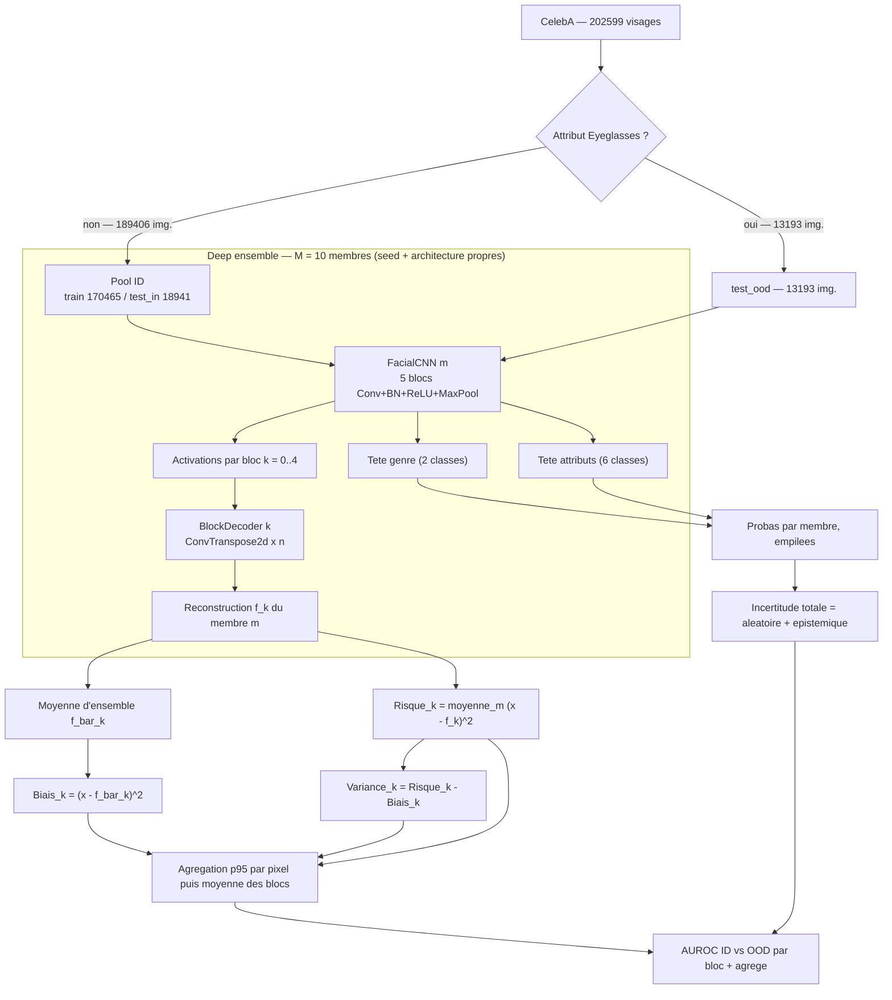
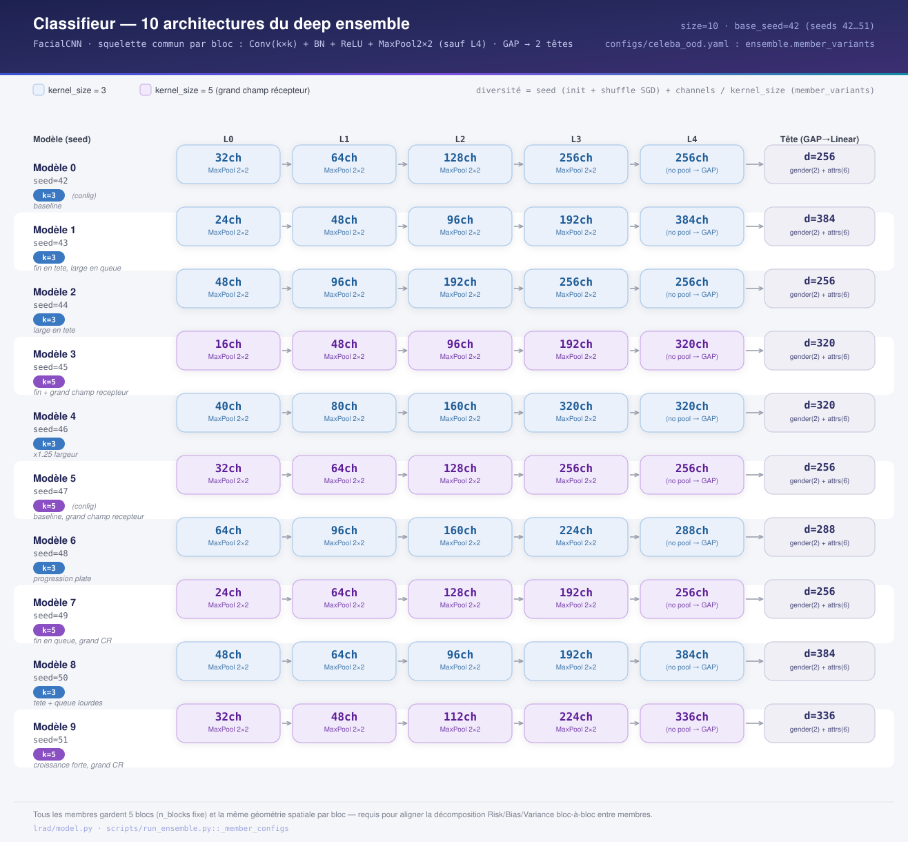
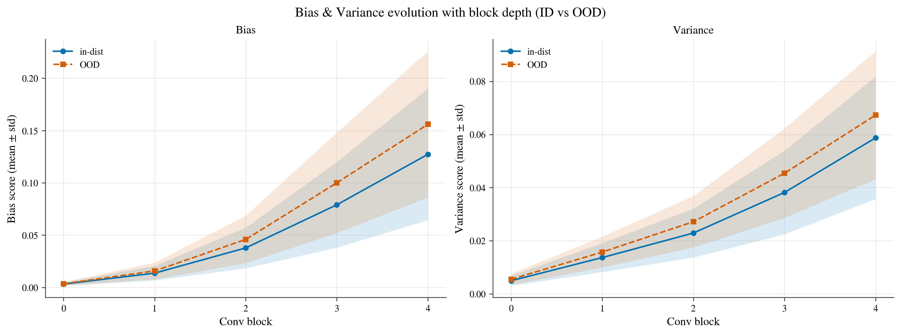
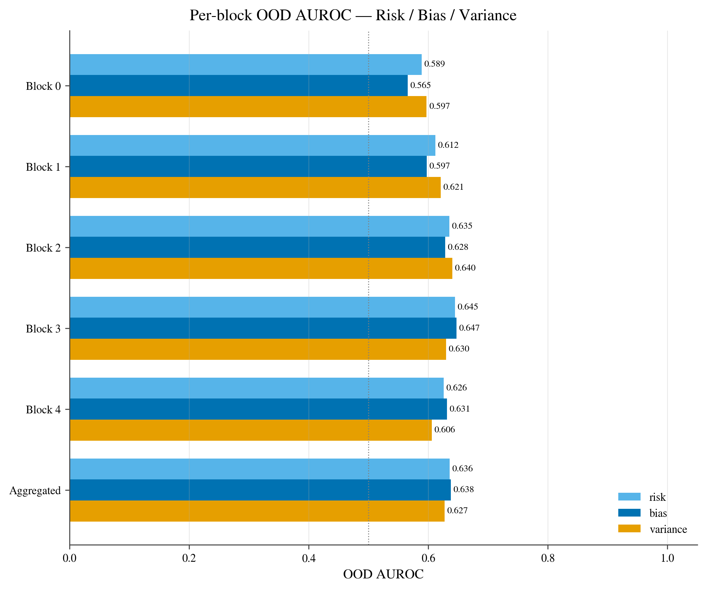
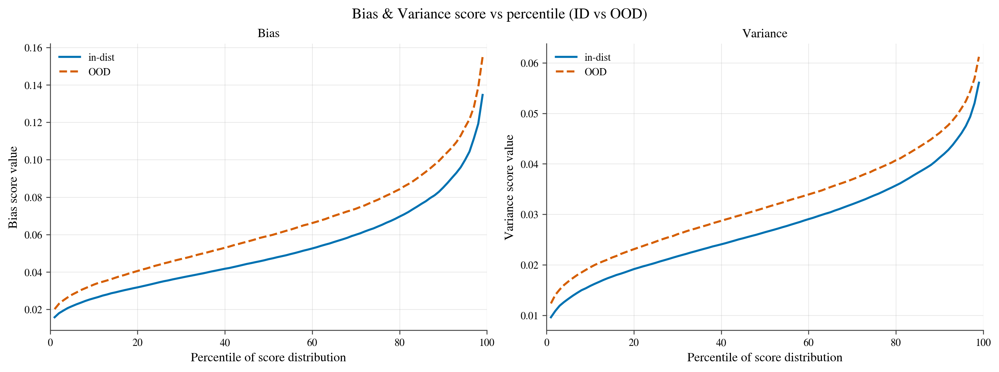
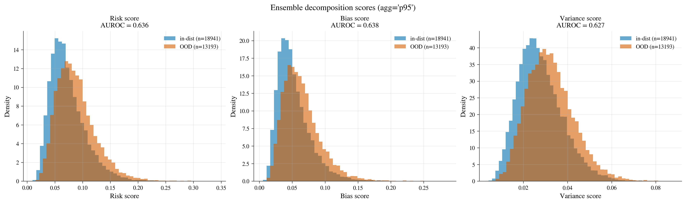
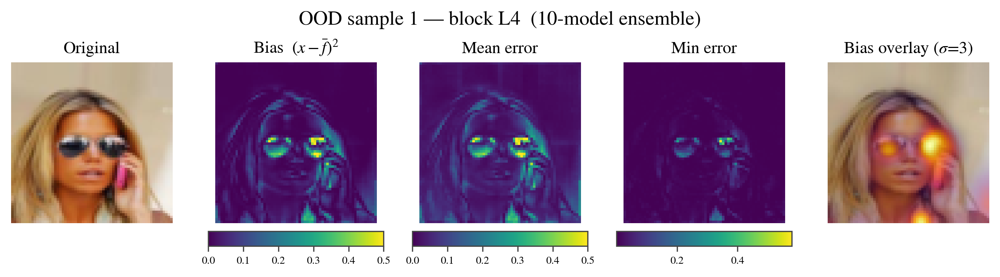
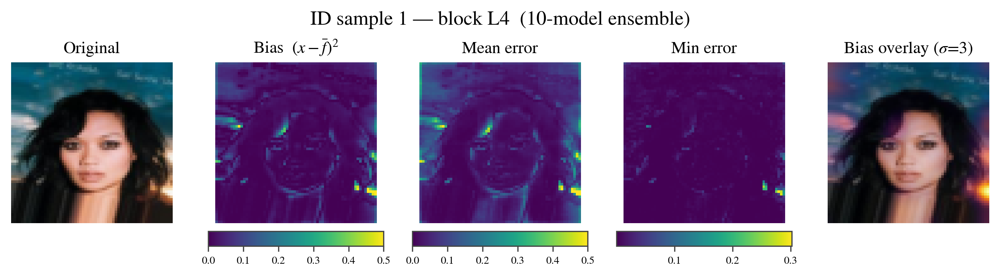
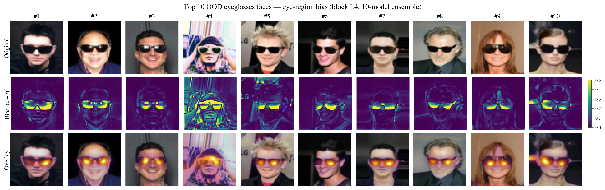

# LRAD — Layer-wise Reconstruction Anomaly Detection


*Dernière mise à jour : 8 juillet 2026 — run de référence : `ensemble_20260707_152254_6754917` (10 modèles, RTX 2080 Ti, ≈ 7 h 44 de calcul)*

> **LRAD** détecte des visages hors-distribution (port de lunettes) sur CelebA en décomposant l'erreur de reconstruction d'un *deep ensemble* de 10 CNN architecturalement diversifiés en un terme de **biais** (l'anomalie) et un terme de **variance** (l'incertitude épistémique), avec l'identité exacte `Risque = Biais + Variance` vérifiée pixel par pixel (résidu ≈ 2×10⁻⁷). Sur l'exécution de référence, le score de biais pixel atteint une AUROC de **0.638**, dépassé par le désaccord des têtes de classification de l'ensemble (incertitude épistémique prédictive) à **0.740**.

---

## Sommaire

- [Contexte et objectifs](#contexte-et-objectifs)
- [Méthodologie](#méthodologie)
  - [Pipeline](#pipeline)
  - [Architecture du classifieur](#architecture-du-classifieur)
  - [Décodeurs par bloc](#décodeurs-par-bloc)
  - [Décomposition biais / variance](#décomposition-biais--variance-de-lensemble)
  - [Hyperparamètres](#hyperparamètres)
- [Résultats](#résultats)
  - [Vue d'ensemble quantitative](#vue-densemble-quantitative)
  - [Biais et variance par profondeur](#évolution-du-biais-et-de-la-variance-avec-la-profondeur)
  - [Séparabilité par percentile](#séparabilité-par-percentile)
  - [Distributions des scores](#distributions-des-scores-agrégés)
  - [Cas qualitatifs](#cas-qualitatifs)
  - [Diversité inter-membres](#diversité-inter-membres-de-lensemble)
- [Interprétation globale et discussion](#interprétation-globale-et-discussion)
- [Perspectives et prochaines étapes](#perspectives-et-prochaines-étapes)
- [Annexes](#annexes)

---

## Contexte et objectifs

**Problématique traitée.** Détecter, sans jamais les avoir vus à l'entraînement, des visages *hors-distribution* (OOD) — ici des visages portant des lunettes (correctives ou de soleil) sur CelebA — à partir d'un signal purement statistique dérivé d'un ensemble de modèles de reconstruction, sans exemple OOD au moment de l'entraînement et sans seuil calibré à la main.

**Pourquoi cette approche.**
- Un ensemble entraîné uniquement sur des visages « propres » (sans lunettes) reconstruit mal, par construction, toute région qui s'écarte de cette distribution — la reconstruction devient un juge de la vraisemblance sans supervision explicite de l'anomalie.
- La décomposition biais/variance d'un ensemble donne une lecture directe de l'erreur de reconstruction : le **biais** (erreur du modèle *moyen* consensus) isole ce qui est irréductible, la **variance** (désaccord entre membres) isole l'incertitude épistémique — sans sigma, sans normalisation ad hoc, juste l'identité algébrique `Risque = Biais + Variance`.
- L'ensemble est **architecturalement diversifié** : chaque membre a ses propres largeurs de canaux et sa propre taille de noyau (`ensemble.member_variants`), en plus de sa graine d'initialisation et de son ordre de mélange SGD — un choix de diversité plus fort que le seul changement de graine, et qui évite le MC-Dropout (le Dropout a été retiré du modèle pour cette raison).

**Hypothèses de départ.**
1. En forçant 4 des 6 têtes d'attributs (`Arched_Eyebrows`, `Bushy_Eyebrows`, `Narrow_Eyes`, `Bags_Under_Eyes`) à porter sur la région des yeux, et en n'entraînant que sur des visages sans lunettes, le classifieur doit apprendre à regarder cette zone — les lunettes viennent alors occulter exactement l'évidence dont il a besoin, ce qui maximise l'écart d'activation entre visages ID et OOD dans la région des yeux.
2. L'identité `Risque = Biais + Variance` doit se vérifier **exactement**, pixel par pixel — un test de cohérence interne du pipeline, préalable à toute évaluation du pouvoir discriminant du score.
3. Sur une tâche d'occlusion (et non de génération aléatoire de bruit), le terme de variance pixel-space pourrait être un signal OOD plus faible qu'attendu : si tous les membres échouent de la même façon sur la même région occultée, l'erreur est corrélée entre eux (biais élevé, variance modeste). Cette hypothèse est confirmée a posteriori — voir [Discussion](#interprétation-globale-et-discussion).

---

## Méthodologie

### Pipeline



Le pipeline (implémenté par `scripts/run_ensemble.py`) exécute, pour `size = 10` modèles :

1. **Partition ID / OOD** — un visage est OOD dès qu'il porte l'attribut `Eyeglasses` ; `train` / `val` / `test_in` ne contiennent que des visages sans lunettes.
2. **Entraînement du classifieur** — `FacialCNN` (tronc convolutif + 2 têtes) sur `CrossEntropy(genre) + attr_loss_weight · BCE(attributs)`, 20 époques, sans validation (`val_ratio = 0`, pas d'early stopping).
3. **Entraînement des décodeurs** — le classifieur est gelé, un `BlockDecoder` par bloc apprend à reconstruire l'image d'entrée à partir des activations gelées de ce bloc (perte MSE, 25 époques, aucun régularisateur — la diversité de l'ensemble vient uniquement de l'architecture, de l'init et du mélange SGD).
4. **Décomposition d'ensemble** — au moment de l'évaluation, les `M = 10` reconstructions par bloc sont combinées pour former les cartes `Risque`, `Biais`, `Variance` (pixel par pixel), puis réduites à un score scalaire par image (percentile 95, puis moyenne non pondérée sur les 5 blocs).
5. **Décomposition d'incertitude prédictive** — en parallèle, les probabilités prédites par chaque membre sur les têtes de classification sont utilisées pour calculer `Total = Aléatoire + Épistémique` (information mutuelle de l'ensemble, signal BALD).
6. **Classement qualitatif** — les visages OOD sont classés par force et concentration du biais dans la région des yeux, pour produire le top‑10 qualitatif.

### Architecture du classifieur

```python
# lrad/model.py — un bloc convolutif type (répété 5 fois)
def _conv_block(in_ch, out_ch, pool=True, kernel_size=3):
    layers = [
        nn.Conv2d(in_ch, out_ch, kernel_size=kernel_size,
                  padding=kernel_size // 2, bias=False),
        nn.BatchNorm2d(out_ch),
        nn.ReLU(inplace=True),
    ]
    if pool:
        layers.append(nn.MaxPool2d(kernel_size=2, stride=2))
    return nn.Sequential(*layers)

# Tronc par défaut (variante de base, seed 42) :
#   Input (B, 3, 64, 64)
#     Block1: Conv3x3(3->32)   + BN + ReLU + MaxPool2x2  -> (32, 32, 32)
#     Block2: Conv3x3(32->64)  + BN + ReLU + MaxPool2x2  -> (64, 16, 16)
#     Block3: Conv3x3(64->128) + BN + ReLU + MaxPool2x2  -> (128, 8, 8)
#     Block4: Conv3x3(128->256)+ BN + ReLU + MaxPool2x2  -> (256, 4, 4)
#     Block5: Conv3x3(256->256)+ BN + ReLU                -> (256, 4, 4)
#     AdaptiveAvgPool -> (256,)
#     head_gender: Linear(256 -> 2)   # softmax + CrossEntropy
#     head_attrs:  Linear(256 -> 6)   # sigmoid + BCE
```

Les 10 membres de l'ensemble partagent cette **même topologie spatiale** (5 blocs, pool après les 4 premiers) mais diffèrent par leurs largeurs de canaux et la taille de leur noyau (`ensemble.member_variants`), ce qui garantit que le bloc `k` correspond à la même échelle spatiale d'un membre à l'autre tout en maximisant la diversité architecturale.



*Les 10 variantes d'architecture utilisées dans l'ensemble : largeurs de canaux et taille de noyau (3×3 ou 5×5) diffèrent, la topologie (5 blocs, pool après les 4 premiers) reste identique.*

### Décodeurs par bloc

```python
# lrad/decoder.py — une étape d'upsampling x2 apprise
def _up_stage(in_ch, out_ch):
    return [
        nn.ConvTranspose2d(in_ch, out_ch, kernel_size=4,
                           stride=2, padding=1, bias=False),
        nn.BatchNorm2d(out_ch),
        nn.ReLU(inplace=True),
    ]
# BlockDecoder empile ces étages jusqu'à retrouver la résolution
# d'entrée (64x64), divise les canaux par 2 à chaque étage (plancher
# min_channels=16), puis termine par Conv1x1 + Sigmoid.
```

Chaque décodeur est un `ConvTranspose2d(4×4, stride 2)` — **aucune variante bilinéaire** n'est utilisée dans ce pipeline (elle a été retirée pour ne garder qu'une seule famille de décodeur, plus simple à comparer entre blocs).

### Décomposition biais / variance de l'ensemble

```python
# lrad/ensemble.py — decomposition_maps() (résumé)
# recons: (M, B, 3, H, W) — reconstructions des M membres au bloc k
mean_recon = recons.mean(dim=0)
se_per_model = ((images.unsqueeze(0) - recons) ** 2).sum(dim=2)   # (M, B, H, W)

risk     = se_per_model.mean(dim=0)                     # E_D[(x - f^m)^2]
bias     = ((images - mean_recon) ** 2).sum(dim=1)      # (x - f_bar)^2
variance = ((recons - mean_recon.unsqueeze(0)) ** 2).sum(dim=2).mean(dim=0)
# identité exacte, pixel par pixel : risk == bias + variance
```

L'erreur quadratique est **sommée** (non moyennée) sur les 3 canaux RGB, sans racine — un pixel vit donc dans `[0, 3]`. C'est cette convention qui garantit que `Risque = Bias + Variance` tient exactement, y compris après agrégation. Le score d'anomalie retenu par le pipeline est le **biais** lui-même (`anomaly_score.py`), sans sigma ni division.

Cette identité et les propriétés associées (positivité des termes, variance nulle pour des modèles identiques, monotonie du minimum robuste par quantile, etc.) sont couvertes par une suite de tests (`tests/test_ensemble.py`, `tests/test_decoder.py`) — 17 tests sur le module de décomposition, 4 sur les décodeurs.

### Hyperparamètres

| Section | Paramètre | Valeur |
| --- | --- | --- |
| `dataset` | résolution image | 64 × 64 |
| `dataset` | batch size | 256 |
| `dataset` | train / val ratio | 0.90 / 0.00 (pas d'early stopping) |
| `dataset` | `ood_attrs` | `[Eyeglasses]` |
| `model` (variante de base) | `channels` | `[32, 64, 128, 256, 256]` |
| `model` (variante de base) | `kernel_size` | 3 |
| `model` | `n_attrs` / `n_gender` | 6 / 2 |
| `training` | époques classifieur | 20 |
| `training` | lr classifieur (Adam) | 3 × 10⁻⁴ |
| `training` | `attr_loss_weight` | 2.0 |
| `training.decoders` | époques décodeurs | 25 |
| `training.decoders` | lr décodeurs (Adam) | 1 × 10⁻³ |
| `evaluation` | agrégation pixel → scalaire | `p95` |
| `evaluation` | `overlay_sigma` / `overlay_power` | 3 / 0.8 (affichage uniquement) |
| `evaluation` | instances ID / OOD illustrées | 20 / 20 |
| `evaluation` | `n_top_ood` | 10 |
| `ensemble` | taille (M) | 10 |
| `ensemble` | `base_seed` | 42 (graines 42…51) |
| `ensemble` | agrégation décomposition | `p95` |

**Les 10 variantes d'architecture (`ensemble.member_variants`)**, avec le nombre de paramètres réellement mesuré au chargement du modèle (run du 2026‑07‑07) :

| # | Seed | `channels` | `kernel_size` | Paramètres |
| ---: | ---: | --- | :---: | ---: |
| 1 | 42 | [32, 64, 128, 256, 256] | 3 | 981 288 |
| 2 | 43 | [24, 48, 96, 192, 384] | 3 | 886 496 |
| 3 | 44 | [48, 96, 192, 256, 256] | 3 | 1 244 600 |
| 4 | 45 | [16, 48, 96, 192, 320] | 5 | 2 136 312 |
| 5 | 46 | [40, 80, 160, 320, 320] | 3 | 1 531 888 |
| 6 | 47 | [32, 64, 128, 256, 256] | 5 | **2 719 528** (max) |
| 7 | 48 | [64, 96, 160, 224, 288] | 3 | 1 102 408 |
| 8 | 49 | [24, 64, 128, 192, 256] | 5 | 2 091 584 |
| 9 | 50 | [48, 64, 96, 192, 384] | 3 | **886 496** ≈ min (918 328) |
| 10 | 51 | [32, 48, 112, 224, 336] | 5 | 2 688 200 |

---

## Résultats

Chiffres du run `ensemble_20260707_152254_6754917` : 10 modèles entraînés séquentiellement sur une **NVIDIA RTX 2080 Ti** (PyTorch 2.5.1+cu121), `train = 170 465` / `test_in = 18 941` / `test_ood = 13 193` images, durée totale d'entraînement **27 453 s (≈ 7 h 37 min)**, pipeline complet (entraînement + décomposition + figures) en **≈ 7 h 44 min**.

### Vue d'ensemble quantitative

| Score | AUROC (ID vs OOD) |
| --- | ---: |
| MSP — pire membre (seed 43) | 0.444 |
| MSP — meilleur membre (seed 48) | 0.756 |
| Entropie (tête genre) — meilleur membre (seed 48) | **0.791** |
| Entropie (têtes combinées) — meilleur membre (seed 49) | 0.652 |
| Score fusion pixel max — modèle seul (seed 51) | 0.598 |
| Risque d'ensemble, agrégé (`p95`) | 0.636 |
| **Biais d'ensemble, agrégé — score retenu par le pipeline** | **0.638** |
| Variance d'ensemble, agrégée | 0.627 |
| Biais d'ensemble — meilleur bloc seul (L3) | 0.647 |
| Incertitude prédictive totale (têtes combinées) | 0.725 |
| Incertitude aléatoire (têtes combinées) | 0.653 |
| **Incertitude épistémique (têtes combinées) — meilleur signal global** | **0.740** |

> ✅ L'identité `Risque = Biais + Variance` est vérifiée à **2 × 10⁻⁷** près (résidu absolu maximal sur 25 images de contrôle) — au niveau du bruit numérique float32, donc structurellement correcte.
>
> ⚠️ Le score pixel (biais), bien que cohérent avec l'hypothèse de départ, ne dépasse pas 0.65 d'AUROC agrégé : le désaccord des **prédictions** de classification (incertitude épistémique) est le signal OOD le plus fort mesuré dans ce run, pas la reconstruction pixel elle-même.

### Évolution du biais et de la variance avec la profondeur



Le biais et la variance croissent tous deux avec la profondeur du bloc (attendu : les blocs profonds ont un champ récepteur plus large et une résolution spatiale plus faible, donc une reconstruction plus grossière), et pour les deux termes, la courbe OOD (orange) se détache visiblement de la courbe ID (bleu) à partir du bloc 2, l'écart étant maximal au bloc 4 — cohérent avec le tableau AUROC par bloc (`decomposition_auroc.png`, ci-dessous) où le biais atteint son maximum au bloc 3 (0.647) avant de légèrement redescendre au bloc 4 (0.631). Les bandes ±1 écart-type se chevauchent fortement sur toute la plage, ce qui traduit visuellement la modestie de l'AUROC agrégée (~0.64) : la séparation existe en moyenne mais reste bruitée au niveau individuel.



*Détail chiffré par bloc (agg = `p95`) :*

| Bloc | Risque | Biais | Variance |
| :---: | ---: | ---: | ---: |
| L0 | 0.589 | 0.565 | 0.597 |
| L1 | 0.612 | 0.597 | 0.621 |
| L2 | 0.635 | 0.628 | 0.640 |
| **L3** | 0.645 | **0.647** | 0.630 |
| L4 | 0.626 | 0.631 | 0.606 |
| **Agrégé** | 0.636 | 0.638 | 0.627 |

### Séparabilité par percentile



Pour chaque percentile `q ∈ [1, 99]` de la distribution des scores, la courbe OOD (orange, pointillée) reste au-dessus de la courbe ID (bleu) sur toute la plage — le biais ID passe d'environ 0.016 (1ᵉ percentile) à 0.134 (99ᵉ), contre 0.021 à 0.155 pour l'OOD ; la variance suit un profil similaire mais avec un écart proportionnellement plus resserré. L'écart entre les deux courbes ne s'effondre jamais à zéro : il n'y a pas de plage de score où le signal disparaît complètement, mais l'écart reste modeste (jamais plus de ~15 % relatif), ce qui explique une AUROC dans la zone 0.63–0.64 plutôt que > 0.9.

### Distributions des scores agrégés



Les trois histogrammes (n=18 941 ID, n=13 193 OOD) montrent un chevauchement massif entre les deux populations, avec un décalage net mais partiel de la masse OOD (orange) vers la droite. C'est la signature visuelle attendue d'une AUROC proche de 0.6–0.65 : un classifieur à seuil unique sur ce score commettra nécessairement un nombre substantiel de faux positifs/négatifs, quel que soit le seuil choisi.

### Cas qualitatifs



Sur cet exemple OOD (lunettes de soleil), le biais `(x − f̄)²` s'allume précisément sur les verres des lunettes — deux points chauds jaunes nettement délimités — et la superposition (« Bias overlay ») confirme que l'anomalie détectée coïncide avec la zone occultée par l'accessoire, exactement l'hypothèse de départ H1.



Sur cet exemple ID (aucune lunette), le biais reste globalement bas, mais **pas parfaitement nul** : deux petits points chauds apparaissent — l'un sur une mèche de cheveux qui occulte partiellement un œil, l'autre dans un coin de l'image sur un filigrane/texte incrusté (« Getty Images »). C'est une source de faux positifs identifiée qualitativement : toute occlusion locale de la zone des yeux (cheveux, texte, main) — pas seulement des lunettes — active le même signal.



Le classement qualitatif (biais moyen dans la fenêtre des yeux × concentration, `lrad.ensemble.collect_eye_region_bias`) fait ressortir 10 visages où le biais est fortement concentré sur les verres — lunettes de soleil opaques en tête de classement (scores 0.57–1.07), cohérent avec l'intuition que plus la lentille est opaque, plus elle masque la texture de l'œil et plus le biais est fort. Le score du visage classé n°1 (`ood_dataset_index=3321`, score = 1.066) domine nettement le reste du classement.

### Diversité inter-membres de l'ensemble

Les scores de confiance issus d'un **seul** modèle (MSP, entropie) varient énormément selon l'architecture du membre : l'AUROC du score MSP seul va de **0.444** (seed 43, `channels=[24,48,96,192,384]`) à **0.756** (seed 48, `channels=[64,96,160,224,288]`) — un écart de 0.31 point d'AUROC pour la même tâche, le même jeu de données, la seule variable étant l'architecture + la graine. La précision de classification du genre (test_in), elle, reste stable : de 91.9 % (seed 43) à 97.7 % (seed 49), moyenne **96.2 %** sur les 10 membres — un modèle peut donc être un bon classifieur et un mauvais détecteur OOD par confiance, ce qui motive directement l'usage de l'ensemble plutôt que d'un score single-model.

---

## Interprétation globale et discussion

- ✅ **La décomposition est correcte et robuste.** L'identité `Risque = Biais + Variance` tient à 2 × 10⁻⁷ près, et 21 tests unitaires couvrent les propriétés algébriques du module (positivité, cas dégénérés à variance nulle, monotonie du minimum robuste). Le pipeline n'est pas juste vraisemblable, il est vérifié.
- ✅ **Le biais localise correctement l'anomalie.** Sur les cas qualitatifs (top‑10 OOD, résumé d'instance), le signal s'allume précisément sur les verres des lunettes et pas ailleurs sur le visage — la carte de biais n'est pas un signal diffus, elle a une sémantique spatiale interprétable.
- ⚠️ **Le signal pixel reste modeste (AUROC ≈ 0.64).** L'hypothèse de départ H3 se confirme : sur une tâche d'*occlusion* (par opposition à une tâche de génération hors-manifold), tous les membres de l'ensemble échouent de façon corrélée sur la même région masquée — l'erreur est donc majoritairement du biais, pas de la variance, et la variance pixel-space (`AUROC = 0.627`) n'apporte pas le supplément d'information qu'on attend généralement d'un signal épistémique en détection OOD.
- ✅ **Le signal qui fonctionne le mieux est ailleurs : l'incertitude prédictive des têtes de classification** (`AUROC épistémique = 0.740`, contre 0.638 pour le biais pixel). C'est cohérent avec la remarque documentée dans `lrad/ensemble.py` : le désaccord qui compte est celui des **prédictions** (le classifieur extrapole différemment selon l'architecture face à une entrée occluse), pas celui des **pixels reconstruits** (qui échouent tous pareil).
- ⚠️ **Faux positifs qualitatifs identifiés.** Le cas ID illustré ci-dessus montre que toute occlusion locale de la zone des yeux (mèche de cheveux, filigrane/texte incrusté sur l'image source) déclenche un pic de biais comparable à un vrai OOD — le score n'est donc pas spécifique aux « lunettes », mais plus généralement à « occlusion de la région entraînée comme discriminante ». C'est attendu compte tenu du design (H1), mais c'est aussi une limite pour un déploiement en conditions réelles où d'autres occlusions (masques, mains, cheveux) sont fréquentes.
- ⚠️ **Grande variance inter-architecture des scores single-model.** Le fait qu'un score de confiance MSP passe de 0.44 à 0.76 d'AUROC selon la seule architecture du membre (à jeu de données et protocole d'entraînement identiques) indique que les résultats single-model publiés dans la littérature OOD sont probablement très sensibles au choix arbitraire d'architecture — un argument de plus en faveur de l'évaluation en ensemble plutôt qu'en single-run.
- **Comparaison à la littérature / à une baseline externe.** Aucune baseline externe (ODIN, Mahalanobis, autoencodeur single-model non ensembliste, score de confiance calibré par température) n'a encore été mesurée sur ce même split dans ce dépôt — AUROC de référence : `[----]`. C'est identifié comme travail futur (voir ci-dessous) plutôt qu'un chiffre à comparer aujourd'hui.

---

## Perspectives et prochaines étapes

**Court terme**
- Mesurer une baseline externe simple (Mahalanobis sur les features du tronc gelé, ou température-scaling du MSP) sur le même split, pour donner un point de comparaison chiffré au tableau de résultats.
- Étudier l'impact des faux positifs « occlusion générique » (cheveux, filigrane) : quantifier leur fréquence sur `test_in` et évaluer si un score combiné (biais pixel + incertitude épistémique) réduit ce bruit.
- Basculer le score d'anomalie officiel de « biais pixel » vers « incertitude épistémique combinée », qui est empiriquement le signal le plus fort de ce run (0.740 vs 0.638 d'AUROC) — ou publier les deux comme deux signaux complémentaires.

**Moyen terme**
- Étendre `dataset.ood_attrs` à d'autres accessoires (`Wearing_Hat`, `Wearing_Necklace`, masques si disponibles) pour vérifier si le signal se généralise à d'autres occlusions, ou s'il reste spécifique à la zone des yeux par construction (têtes d'attributs).
- Étudier `scripts/epoch_variability_study.py` (déjà présent dans le dépôt, checkpoints par époque disponibles via `training.save_every_epoch`) pour caractériser à quelle vitesse la variance inter-modèles σ(e) se stabilise pendant l'entraînement, et si un ensemble entraîné moins longtemps conserverait le même pouvoir discriminant à coût de calcul réduit (le run complet prend ≈ 7h44 sur une seule RTX 2080 Ti).
- Passer de l'agrégation `p95` fixe à une agrégation apprise (pondération par bloc optimisée sur un petit set de validation OOD proxy), pour capter le fait que le bloc L3 domine déjà tous les autres en AUROC.

**Long terme**
- Explorer une variante où le biais et l'incertitude épistémique sont fusionnés en un score unique appris (plutôt que deux signaux séparés), avec une évaluation de calibration (pas seulement l'AUROC) pour un usage en production.
- Généraliser le protocole (from-scratch, sans poids pré-entraînés, ensemble architecturalement diversifié) à un autre domaine que les visages, pour vérifier si la conclusion « l'incertitude prédictive bat le biais pixel sur les tâches d'occlusion » est spécifique à CelebA/lunettes ou plus générale.

---

## Annexes

### Environnement technique

| | |
| --- | --- |
| Matériel (run de référence) | 1 × NVIDIA GeForce RTX 2080 Ti (11 GiB), cluster **graffiti** — Grid'5000 Nancy |
| Runtime observé | PyTorch 2.5.1+cu121, CUDA 12.1 |
| Runtime épinglé (`requirements.txt`) | `torch==2.4.1+cu118` / `torchvision==0.19.1+cu118` (build CUDA 11.8, compatible GPU Pascal sm_61) |
| Python | ≥ 3.10 |
| Ordonnancement | OAR, job `6754917`, file production/Abaca, walltime demandé 48 h |
| Durée réelle du run | 27 453 s (~7 h 37) d'entraînement des 10 modèles + ~6 min de décomposition/figures |
| Bibliothèques clés | NumPy < 2.0, SciPy (lissage de l'overlay), scikit-learn (AUROC), matplotlib (export 300 dpi), PyYAML |

### Reproduire ce run

```bash
python scripts/run_ensemble.py --config configs/celeba_ood.yaml
# ou, pour ré-exécuter uniquement la décomposition sur des modèles déjà entraînés :
python scripts/run_ensemble.py --config configs/celeba_ood.yaml \
    --output-dir outputs/celeba_ood/<run> --eval-only
```

### Liens vers le code source

| Fichier | Rôle |
| --- | --- |
| [`lrad/model.py`](../lrad/model.py) | `FacialCNN` — tronc convolutif + têtes genre/attributs |
| [`lrad/decoder.py`](../lrad/decoder.py) | `BlockDecoder` — reconstruction par bloc |
| [`lrad/train.py`](../lrad/train.py) | Boucles d'entraînement classifieur + décodeurs |
| [`lrad/ensemble.py`](../lrad/ensemble.py) | Décomposition Risque/Biais/Variance + incertitude prédictive |
| [`lrad/dataset.py`](../lrad/dataset.py) | Chargeurs CelebA, partition ID/OOD configurable |
| [`lrad/plots.py`](../lrad/plots.py) | Toutes les figures (style article, 300 dpi) |
| [`configs/celeba_ood.yaml`](../configs/celeba_ood.yaml) | Configuration unique (dataset/modèle/entraînement/ensemble) |
| [`scripts/run_ensemble.py`](../scripts/run_ensemble.py) | Runner principal (pipeline complet) |
| [`tests/`](../tests/) | 21+ tests sur la décomposition et les décodeurs |

### Note sur les figures de ce document

Le dossier `outputs/` (qui contient le run complet, y compris les poids des modèles et toutes les figures brutes) est exclu du dépôt Git (`.gitignore`). Les figures présentées ci-dessus ont été copiées dans [`docs/figures/`](figures/) pour rester consultables directement sur GitHub ; le run complet reste reproductible via la commande ci-dessus.
